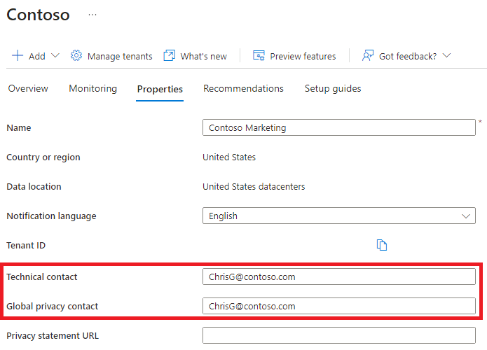

---
lab:
  title: 02 – Trabalhando com propriedades de locatário
  learning path: '01'
  module: Module 01 - Implement an Identity Management Solution
---

# Laboratório 02: Trabalhando com propriedades de locatário

## Cenário do laboratório

Você precisa identificar e atualizar as diferentes propriedades associadas ao seu locatário.

#### Tempo estimado: 15 minutos

### Exercício 1 – Criar subdomínios personalizados 

#### Tarefa 1 – Criar um nome de subdomínio personalizado

1. Navegue até [https://entra.microsoft.com](https://entra.microsoft.com) e entre usando uma Conta de administrador global para o diretório.

1. No menu **Identidade**, use a opção **Mostrar mais* na parte inferior.

1.  Abra o menu **Configurações** e selecione **Nomes de domínio**.

1. Selecione **+ Adicionar domínio personalizado**.

1. No campo **Nome de domínio personalizado**, crie um subdomínio personalizado para o locatário do laboratório colocando **vendas** na frente do nome de domínio **onmicrosoft.com**.  O formato será semelhante a este:

    ```
    sales.labtenant.onmicrosoft.com
    ```

1. **Observação**: Você será solicitado a abrir o centro de administração do Microsoft 365 para concluir essa ação.

1. Selecione **Adicionar domínio** para adicionar o subdomínio.


### Exercício 2 – Alterar o nome de exibição do locatário

#### Tarefa 1 – Definir o nome do locatário e o contato técnico

1. A partir do centro de administração do Microsoft Entra, abra o menu **Identidade**.

1. Na navegação à esquerda, selecione o item de menu **Visão geral** e selecione **Propriedades**.

1. Altere as propriedades **Nome** e **Contato técnico** do locatário na caixa de diálogo.

    | **Configuração** | **Valor** |
    | :--- | :--- |
    | Nome | Marketing da Contoso |
    | Contato técnico | `your Global admin account` |

1. Selecione **Salvar** para atualizar as propriedades do locatário.

   **Você notará a mudança de nome imediatamente após salvar.**

#### Tarefa 2 – Analise o país ou região e outros valores associados ao seu locatário

1. No menu **Identidade**, selecione **Visão geral** e **Propriedades**.

2. Em **Propriedades do locatário**, localize **País ou região** e examine as informações.

    **IMPORTANTE** – Quando o locatário é criado, o país ou região é especificado naquele momento. Não é possível alterar essa configuração posteriormente.

3. Na página **Propriedades**, em **Propriedades do locatário**, busque a **Localização** e analise as informações.

    

#### Tarefa 3 – Encontrar a ID do locatário

As assinaturas do Azure têm uma relação de confiança com o Microsoft Entra ID. O Microsoft Entra ID é confiável para autenticar usuários, serviços e dispositivos para a assinatura. Cada assinatura tem uma ID de locatário associada a ela, e há algumas maneiras de encontrar a ID de locatário da sua assinatura.

1. Abra o centro de administração do Microsoft Entra [https://entra.microsoft.com](https://entra.microsoft.com)

1. No menu **Identidade**, selecione **Visão geral** e **Propriedades**.

1. Em **Propriedades do locatário**, localize a **ID do locatário**. Esse é o seu identificador de locatário exclusivo.

    

### Exercício 3 – Configurar as informações de privacidade

#### Tarefa 1: Adicionar suas informações de privacidade no Microsoft Entra ID, incluindo o contato de privacidade global e a URL da política de privacidade

A Microsoft recomenda enfaticamente que você adicione o contato de privacidade global e a política de privacidade da sua organização, para que os funcionários internos e convidados externos possam examinar suas políticas. Como as declarações de privacidade são exclusivamente criadas e personalizadas para cada empresa, é altamente recomendável que você entre em contato com um advogado para obter assistência.

   **OBSERVAÇÃO** – Para obter informações sobre como visualizar ou excluir dados pessoais, consulte [https://docs.microsoft.com/microsoft-365/compliance/gdpr-dsr-azure](https://docs.microsoft.com/microsoft-365/compliance/gdpr-dsr-azure). Para obter mais informações sobre o GDPR, consulte [https://servicetrust.microsoft.com/ViewPage/GDPRGetStarted](https://servicetrust.microsoft.com/ViewPage/GDPRGetStarted).

Adicione as informações de privacidade da sua organização na área  **Propriedades**  do Microsoft Entra ID. Para acessar a área de Propriedades e adicionar suas informações de privacidade:

1. No menu **Identidade**, selecione **Visão geral** e **Propriedades**.

    

2. Adicione as informações de privacidade de seus funcionários:

- **Contato de privacidade global** - `AllanD@`**seu domínio do laboratório do Azure**
     - Allan Deyoung é um usuário interno em seu locatário do laboratório do Azure que trabalha como administrador de TI, usaremos ele como o contato de privacidade.
     - Essa pessoa é também quem a Microsoft contatará se houver uma violação de segurança. Se não houver nenhuma pessoa listada aqui, a Microsoft entrará em contato com seus administradores globais.

- **URL da política de privacidade** -  <https://github.com/MicrosoftLearning/SC-300-Identity-and-Access-Administrator/blob/master/Allfiles/Labs/Lab2/SC-300-Lab_ContosoPrivacySample.pdf>

     - O PDF de privacidade de exemplo é fornecido no diretório dos laboratórios.
     — Digite o link para o documento da sua organização que descreve como a organização lida com a privacidade dos dados de convidados internos e externos.

    **IMPORTANTE** – Se você não incluir sua própria política de privacidade ou seu contato de privacidade, os convidados externos verão um texto na caixa Examinar permissões em que se lê  **<nome da sua organização\>** não forneceu links para você revisar os termos. Por exemplo, um usuário convidado verá essa mensagem quando receber um convite para acessar uma organização por meio de colaboração B2B.

    

3. Selecione **Salvar**.

#### Tarefa 2 – Verificação da sua política de privacidade

1. Retorne à Tela inicial do Azure – Painel.
2. Selecione o nome de usuário no canto superior direito da interface.
3. Escolha **Exibir conta** no menu suspenso.

     **Uma nova guia do navegador é aberta automaticamente.**

4. Selecione **Configurações e privacidade** no menu à esquerda.
5. Selecione **Privacidade**.
6. Em **Aviso da organização**, selecione o item **Exibição** ao lado da política de privacidade organizacional da Contoso Marketing.

     **Uma nova guia do navegador será aberta com o arquivo PDF de privacidade que você vinculou para ser exibido.**

7. Analise o exemplo da política de privacidade.
8. Feche a guia do navegador com o PDF.
9. Feche a guia do navegador com os itens da **Minha conta**.
