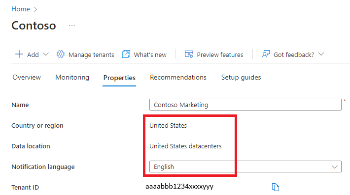

---
lab:
  title: '02: como trabalhar com propriedades de locatário'
  learning path: '01'
  module: Module 01 - Implement an Identity Management Solution
---

# Laboratório 02: como trabalhar com propriedades do locatário

## Cenário do laboratório

Você precisa identificar e atualizar as diferentes propriedades associadas ao seu locatário.

#### Tempo previsto: 15 minutos

### Exercício 1: criar subdomínios personalizados 

#### Tarefa 1: criar um nome de subdomínio personalizado

1. Navegue até [https://portal.azure.com](https://portal.azure.com) e entre usando uma conta de administrador global no diretório.

1. Selecione o ícone de hambúrguer **Mostrar menu do portal** e escolha **Azure Active Directory**.

    

1. Na seção **Gerenciar** do **Azure AD**, selecione **Nomes de domínio personalizados**.

1. Selecione **Adicionar domínio personalizado**.

1. No campo **Nome de domínio personalizado**, crie um subdomínio personalizado para o locatário do laboratório, colocando **vendas** na frente do nome de domínio **onmicrosoft.com**.  O formato será semelhante a este:

    ```
    sales.labtenant.onmicrosoft.com
    ```

1. Selecione **Adicionar domínio** para adicionar o subdomínio.


### Exercício 2: alterar o nome de exibição do locatário

#### Tarefa 1: definir o nome do locatário e o contato técnico

1. No Azure Active Directory, na navegação à esquerda, na seção **Gerenciar**, selecione **Propriedades**.

1. Altere as Propriedades do locatário para o **Nome** e o **Contato técnico** na caixa de diálogo.

    | **Configuração** | **Valor** |
    | :--- | :--- |
    | Nome | Marketing da Contoso |
    | Contato técnico | `your Global admin account` |

1. Selecione **Salvar** para atualizar as propriedades do locatário.

   **Você notará a mudança de nome imediatamente após a conclusão do salvamento.**

#### Tarefa 2: revisar o país ou a região e outros valores associados ao seu locatário

1. Na página **Azure Active Directory**, na seção Gerenciar, selecione **Propriedades**.

2. Em **Propriedades do locatário**, localize **País ou região** e examine as informações.

    **IMPORTANTE**: quando o locatário é criado, o país ou a região são especificados nesse momento. Não é possível alterar essa configuração posteriormente.

3. Na página **Propriedades**, em **Propriedades do locatário**, localize **Localização** e revise as informações.

    

#### Tarefa 3: localizar o ID do locatário

As assinaturas do Azure têm uma relação de confiança com o Azure AD (Azure Active Directory). O Azure AD é confiável para autenticar usuários, serviços e dispositivos para a assinatura. Cada assinatura tem um ID de locatário associado a ela, e há algumas maneiras de encontrar o ID de locatário da sua assinatura.

1. Na página **Azure Active Directory**, na seção Gerenciar, selecione **Propriedades**.

2. Em **Propriedades do locatário**, localize a **ID do locatário**. Esse é o seu identificador de locatário exclusivo.

    

### Exercício 3: definir suas informações de privacidade

#### Tarefa 1: adicionar suas informações de privacidade no Azure AD, incluindo o contato de privacidade global e o URL da política de privacidade

A Microsoft recomenda enfaticamente que você adicione o contato de privacidade global e a política de privacidade da sua organização, para que os funcionários internos e convidados externos possam examinar suas políticas. Como as declarações de privacidade são exclusivamente criadas e personalizadas para cada empresa, é altamente recomendável que você entre em contato com um advogado para obter assistência.

   **OBSERVAÇÃO:** para obter informações sobre como exibir ou excluir dados pessoais, consulte [https://docs.microsoft.com/microsoft-365/compliance/gdpr-dsr-azure](https://docs.microsoft.com/microsoft-365/compliance/gdpr-dsr-azure). Para obter mais informações sobre as GDPR, consulte [https://servicetrust.microsoft.com/ViewPage/GDPRGetStarted](https://servicetrust.microsoft.com/ViewPage/GDPRGetStarted).

Adicione informações de privacidade da sua organização na área  **Propriedades**  do Azure AD. Para acessar a área de Propriedades e adicionar suas informações de privacidade:

1. Na página **Azure Active Directory**, na seção Gerenciar, selecione **Propriedades**.

    

2. Adicione as informações de privacidade de seus funcionários:

- **Contato de privacidade global com** - `AllanD@` **seu domínio de laboratório do Azure**
     - Allan Deyoung é um usuário interno em seu locatário de laboratório do Azure que trabalha como administrador de TI. Usaremos ele como o contato de privacidade.
     - Essa pessoa é também quem a Microsoft contatará se houver uma violação de segurança. Se não houver nenhuma pessoa listada aqui, a Microsoft entrará em contato com seus administradores globais.

- **URL da política de privacidade** -  <https://github.com/MicrosoftLearning/SC-300-Identity-and-Access-Administrator/blob/master/Allfiles/Labs/Lab2/SC-300-Lab_ContosoPrivacySample.pdf>

     - No exemplo de privacidade, o PDF é fornecido no diretório de laboratórios.
     - Digite o link para o documento de sua organização que descreve como a organização lida com a privacidade dos dados de convidados internos e externos.

    **IMPORTANTE:** se você não incluir sua própria política de privacidade ou seu contato de privacidade, os convidados externos verão o texto na caixa Permissões de revisão, que informa que  **<nome da sua organização\>** não forneceu links para você revisar seus termos. Por exemplo, um usuário convidado verá essa mensagem quando receber um convite para acessar uma organização por meio de colaboração B2B.

    

3. Selecione **Salvar**.

#### Tarefa 2: verificar sua política de privacidade

1. Retorne à tela inicial do Azure – Painel.
2. No canto superior direito da interface do usuário, selecione seu nome de usuário.
3. Escolha **Exibir conta** no menu suspenso.

     **Uma nova guia do navegador será aberta automaticamente.**

4. Selecione **Configurações e privacidade** no menu à esquerda.
5. Selecione **Privacidade**.
6. Em **Aviso da organização**, selecione o item **Exibir** ao lado da política de privacidade organizacional do Marketing da Contoso.

     **Uma nova guia do navegador será aberta com a exibição do arquivo PDF de privacidade ao qual você vinculou.**

7. Revise o exemplo de Política de privacidade.
8. Feche a guia do navegador com o PDF.
9. Feche a guia do navegador que exibe os itens de **Minha conta**.
