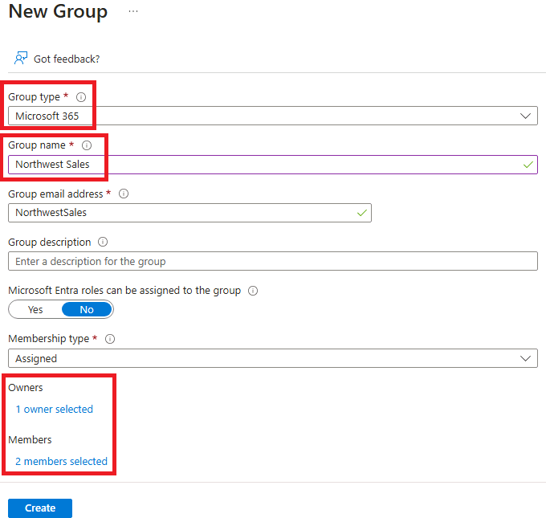

---
lab:
  title: '03: como atribuir as licenças usando a afiliação de grupo'
  learning path: '01'
  module: Module 01 - Implement an identity management solution
---

# Laboratório 03: como atribuir as licenças usando a afiliação de grupo

## Cenário do laboratório

Sua organização decidiu usar grupos de segurança no Azure AD para gerenciar licenças. Você precisa configurar um novo grupo de segurança, atribuir uma licença a esse grupo e verificar se as licenças dos membros do grupo foram atualizadas.

#### Tempo previsto: 25 minutos

### Exercício 1: criar um grupo de segurança e adicionar um usuário

#### Tarefa 1: verificar se Delia Dennis tem acesso ao Office 365

1. Abra uma nova janela anônima do navegador.
2. Conecte-se ao [https://www.office.com](https://www.office.com).
3. Selecione Entrar e conecte-se como Delia Dennis.

   | **Configuração**| **Valor**|
   | :--- | :--- |
   | Nome de Usuário | DeliaD@`your domain name.com`|
   | Senha| Insira a senha do Administrador global em Recursos|

4. Você deve se conectar ao site do Office.com, mas verá uma mensagem indicando que não tem uma licença.

   
    
5. Feche a janela do navegador.

#### Tarefa 2: criar um grupo de segurança no Azure Active Directory

1. Navegue até [https://portal.azure.com/#blade/Microsoft_AAD_IAM/ActiveDirectoryMenuBlade/Overview]( https://portal.azure.com/#blade/Microsoft_AAD_IAM/ActiveDirectoryMenuBlade/Overview).

2. No painel de navegação esquerdo, em **Gerenciar**, selecione **Grupos**.
3. Na página Grupos, no menu, selecione **Novo grupo**.
4. Crie um grupo com as seguintes informações:

   | **Configuração**| **Valor**|
   | :--- | :--- |
   | Tipo de grupo| Segurança|
   | Nome do grupo| sg-SC300-O365|
   | Tipo de afiliação| Atribuído|
   | Proprietários| *Atribuir sua própria conta de administrador como o proprietário do grupo*|

5. Em Membros, selecione o texto **Nenhum membro selecionado**.
6. Selecione **Delia Dennis** na lista de usuários.
7. Escolha o botão **Selecionar**.

   

8. Selecione o botão **Criar**.
9. Ao concluir, verifique se o grupo chamado **sg-SC300-O365** é mostrado na lista **Todos os grupos**.

#### Tarefa 3: atribuir uma licença a um grupo

1. Na lista **Todos os grupos**, selecione **sg-SC300-O365**.
2. Na página Marketing, em **Gerenciar**, selecione **Licenças**.
3. No menu, selecione **+ Atribuições**.
4. Na página de atualização de atribuições de licenças, em **Selecionar licenças**, revise a lista de licenças disponíveis e marque a caixa de seleção do **Office 365 E3**.

   **Dica:** quando várias licenças são selecionadas, você pode usar o menu Revisar opções de licença para selecionar uma licença específica e visualizar a opção de licença para essa licença.

   

6. Selecione **Salvar**.

#### Tarefa 4: confirmar a licença do Office 365

1. Abra uma nova janela anônima do navegador.
2. Conecte-se ao [https://www.office.com](https://www.office.com).
3. Selecione Entrar e conecte-se como Delia Dennis.

   | **Configuração**| **Valor**|
   | :--- | :--- |
   | Nome de Usuário | DeliaD@`your domain name.com`|
   | Senha| Insira a senha do Administrador global em Recursos|

4. Você deve se conectar ao site da Office.com e não ver nenhuma mensagem sobre a licença. Todos os aplicativos do Office estão disponíveis à esquerda.

   
    
5. Feche a janela do navegador. 

### Exercício 2: criar um grupo do Microsoft 365 no Azure Active Directory

#### Tarefa 1: criar o grupo

Parte de suas funções como administrador do Azure AD é criar diferentes tipos de grupos. Você precisa criar um novo grupo do Microsoft 365 para o departamento de vendas da sua organização.

1. Navegue até [https://portal.azure.com/#blade/Microsoft_AAD_IAM/ActiveDirectoryMenuBlade/Overview]( https://portal.azure.com/#blade/Microsoft_AAD_IAM/ActiveDirectoryMenuBlade/Overview).

2. No painel de navegação esquerdo, em **Gerenciar**, selecione **Grupos**.

3. Na página Grupos, no menu, selecione **Novo grupo**.

4. Crie um grupo com as seguintes informações:

   | **Configuração**| **Valor**|
   | :--- | :--- |
   | Tipo de grupo| Microsoft 365|
   | Nome do grupo| Vendas do noroeste|
   | Tipo de afiliação| Atribuído|
   | Proprietários| *Atribuir sua própria conta de administrador como o proprietário do grupo*|
   | Membros| **Alex Wilber** e **Bianca Pisani**|

   

5. Ao concluir, verifique se o grupo chamado **Vendas no noroeste** é mostrado na lista **Todos os grupos**.

### Exercício 3: criar um grupo dinâmico com todos os usuários como membros

#### Tarefa 1: criar o grupo dinâmico

À medida que sua empresa cresce, o gerenciamento manual de grupos consome muito tempo. Desde a padronização do diretório, agora você pode aproveitar os grupos dinâmicos. É necessário criar um novo grupo dinâmico para garantir que você esteja pronto para a criação de grupos dinâmicos na produção.

1. Entre no [https://portal.azure.com](https://portal.azure.com) com uma conta que é atribuída à função Administrador global ou de Administrador de usuário no locatário.

2. Selecione **Azure Active Directory**.

3. Em **Gerenciar**, selecione **Grupos** e, em seguida, selecione **Novo grupo**.

4. Na página novo grupo, em **Tipo de grupo**, selecione **Segurança**.

5. Na caixa **Nome do grupo**, insira **SC300-myDynamicGroup**.

6. Selecione o menu **Tipo de afiliação** e, em seguida, selecione **Usuário dinâmico**.

7. Selecione um **Proprietário** para o grupo.

7. Em **Membros dinâmicos do usuário**, selecione **Adicionar consulta dinâmica**.

8. No lado direito acima da caixa **Sintaxe de regra**, selecione **Editar**.

9. No painel Editar sintaxe de regra, insira a seguinte expressão na caixa **Sintaxe de regra**:

   ```powershell
   user.objectid -ne null
   ```

   **Aviso**: o `user.objectid` diferencia maiúsculas de minúsculas.

10. Selecione **OK**. A regra é exibida na caixa Sintaxe de regra.

   

11. Selecione **Salvar**. O novo grupo dinâmico agora incluirá usuários convidados B2B, assim como usuários membros.

12. Na página Novo grupo, selecione **Criar** para criar o grupo.

#### Tarefa 2: verificar se os membros foram adicionados

**Observação:** a população da afiliação de grupo dinâmica pode demorar até 15 minutos.

1. Selecione na **página inicial** `Azure Active Directory`.
2. Inicie o **Azure Active Directory**.
3. No menu **Gerenciar**, selecione **Grupos**.
4. Na caixa de filtro, digite **SC300** e seu grupo recém-criado será listado.
5. Selecione em **SC300-myDynamicGroup** para abrir o grupo.
6. Observe que ele mostra que contém 30+ ** Membros diretos*.
7. Na seção **Gerenciar**, selecione **Membros**.
8. Analise os membros.

#### Tarefa 3: experimentar regras alternativas

1. Tente criar um grupo apenas com usuários **convidados**:

   - (user.objectid -ne null) e (user.userType -eq "Convidado")

2. Tente criar um grupo apenas com **Membros** dos usuários do Azure AD.

   - (user.objectid -ne null) e (user.userType -eq "Membro")
