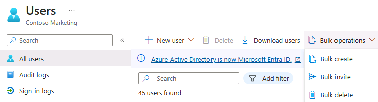

---
lab:
  title: 05 – Adicionar usuários convidados ao diretório
  learning path: '01'
  module: Module 01 - Implement an identity management solution
---

# Laboratório 05: adicionar usuários convidados ao diretório

### Tipo de logon = administração do Microsoft 365

## Cenário do laboratório

Sua empresa trabalha com muitos fornecedores e, ocasionalmente, você precisa adicionar algumas contas de fornecedor ao seu diretório como convidado.

#### Tempo estimado: 20 minutos

### Exercício 1 – adicionar usuários convidados ao diretório

#### Tarefa – Adicionar o usuário convidado

1. Entre no  [https://entra.Microsoft.com](https://entra.microsoft.com) como usuário atribuído a uma função de diretório de administrador limitada, ou Emissor de convites independente, ou Administrador global.

2. Selecione **Identidade**.

3. Em  **Usuários**, selecione **Todos os usuários**.

4. Selecione  **+ Novo usuário**.

5. Na página Novo usuário, selecione **Convidar usuário externo** e adicione suas informações como usuário convidado.

    **OBSERVAÇÃO** – Não há suporte para endereços de email de grupo; insira o endereço de email para um indivíduo. Além disso, alguns provedores de email permitem que os usuários adicionem um sinal de adição (+) de símbolo e texto adicional aos seus endereços de email para ajudar com coisas como a filtragem de caixa de entrada. No entanto, o Microsoft Entra ID atualmente não dá suporte a símbolos de adição em endereços de email. Para evitar problemas de entrega, omita o símbolo de adição e quaisquer caracteres seguintes até o símbolo @.

6. Digite um endereço de email, como **sc300externaluser1@sc300email.com**.

7. Clique na guia **Propriedades**.

8. Na página Usuários, verifique se sua conta está listada e, na coluna **Tipo de usuário**, verifique se **Convidado** é mostrado.

9. Selecione **Revisar + convidar** e selecione **Convidar**.


Depois de enviar o convite, a conta de usuário é automaticamente adicionada ao diretório como convidado.


### Exercício 2 – Convidar usuários convidados em massa

#### Tarefa 1 – Convite de usuário em massa

Uma parceria recente foi estabelecida com outra empresa. Por enquanto, funcionários da empresa parceira serão adicionados como convidados. Você precisa garantir que possa importar vários usuários convidados ao mesmo tempo.

1. Entre no [https://entra.microsoft.com](https://entra.microsoft.com) como administrador global.

2. No painel de navegação, selecione **Identidade**.

3. Em **Usuários**, selecione **Todos os usuários**.

4. Na página Usuários, no menu, selecione **Operações em massa > Convite em massa**.

     

5. No painel de usuários do convite em massa, selecione **Baixar** para um modelo CSV de exemplo com propriedades de convite.

6. Usando um editor para exibir o arquivo CSV, examine o modelo.

7. Abra o modelo .csv e adicione uma linha para cada usuário convidado. Os valores obrigatórios são:

    - **Endereço de email a ser convidado** – o usuário que receberá um convite
    - **URL de redirecionamento** – a URL para a qual o usuário convidado é encaminhado depois de aceitar o convite.

    

8. Salve o arquivo.

9. Na página Convidar usuários em massa, em **Carregar o arquivo CSV**, procure o arquivo.

     **Observação** – Quando você selecionar o arquivo, a validação do arquivo .csv será iniciada.

10. Após a validação do conteúdo do arquivo, você verá a mensagem **Arquivo carregado com êxito**. Se houver erros, você precisará corrigi-los antes de enviar o trabalho.

    

11. Quando o arquivo passar na validação, selecione **Enviar** para iniciar a operação em massa do Azure que adiciona os convites.

12. Para exibir o status do trabalho, selecione **Clique aqui para exibir o status de cada operação**. Se preferir, selecione **Resultados da operação em massa** na seção Atividade. Para obter detalhes de cada item de linha na operação em massa, escolha os valores nas colunas **Nº de Êxitos**, **Nº de Falhas** ou **Total de Solicitações**. Se ocorrerem falhas, os motivos da falha serão listados.

    

13. Quando o trabalho for concluído, você verá uma notificação indicando que a operação em massa foi bem-sucedida.

#### Tarefa 2 – Convidar usuários convidados em massa com o PowerShell

1. Abra o PowerShell como administrador. Isso pode ser feito pesquisando o PowerShell no Windows e escolhendo Executar como administrador. 

**Observação** – Você precisa ter o PowerShell versão 7.2 ou superior para que este laboratório funcione.  Quando o PowerShell abrir, você obterá uma versão na parte superior da tela, se estiver executando uma versão mais antiga, atualize ou esta parte do laboratório falhará.

2. Você precisará instalar o módulo do Microsoft.Graph PowerShell se não o tiver usado antes.  Execute s dois comandos a seguir e confirme a operação quando solicitado apertando Y:

    ```
    Install-Module Microsoft.Graph
    ```
3. Confirme se o módulo do Microsoft.Graph está instalado:

    ```
    Get-InstalledModule Microsoft.Graph
    ```
    

4. Em seguida, você precisará fazer logon no Azure executando:  

    ```
    Connect-MgGraph -Scopes "User.ReadWrite.All"
    ``` 
    O navegador Edge será aberto e solicitaremos que você entre.  Use a conta de Administrador do MOD para se conectar.  Marque a caixa de consentimento, aceite a solicitação de permissões e feche a janela do navegador.

5. Defina os valores para o email e redirecione para o usuário externo:

    ```
    Import-Module Microsoft.Graph.Identity.SignIns
    
    $params = @{
        invitedUserEmailAddress = "admin@fabrikam.com"
        inviteRedirectUrl = "https://myapp.contoso.com"
    }
    ```

6. Enviou o comando MgInvitation para convidar o usuário externo:

    ```
    New-MgInvitation -BodyParameter $params
    ```

7. Você pode fechar o PowerShell neste ponto.
    
Agora você sabe como convidar usuários no Centro de administração do Microsoft Entra, no Centro de administração do Microsoft 365, nos convites em massa com um arquivo csv e invitar usuários com comandos do PowerShell.  Você pode entrar no Centro de administração do Microsoft Entra e verificar Todos os Usuários para ver se o ADMIN foi adicionado como um usuário externo.
