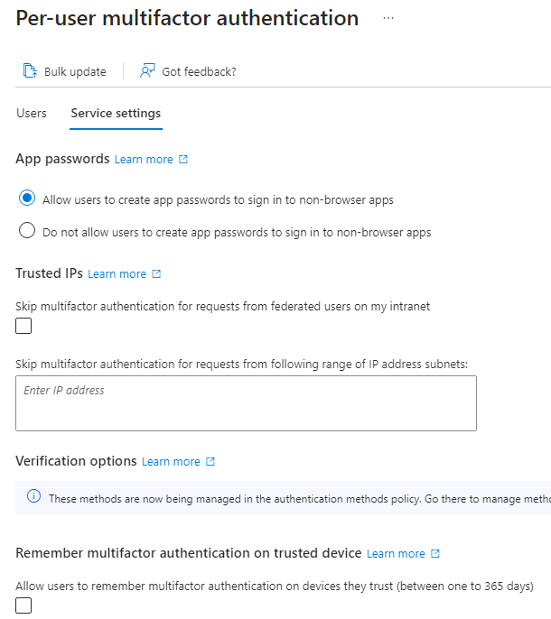

---
lab:
  title: '08: habilitar a autenticação multifator do Azure AD'
  learning path: '02'
  module: Module 02 - Implement an Authentication and Access Management Solution
---

# Laboratório 08: habilitar a autenticação multifator do Azure AD

## Cenário do laboratório

Para melhorar a segurança em sua organização, você foi direcionado para habilitar a autenticação multifator para o Azure Active Directory.

#### Tempo previsto: 15 minutos

**IMPORTANTE:** uma licença do Azure AD Premium é necessária para este exercício.

### Exercício 1: revisar e habilitar a autenticação multifator no Azure

#### Tarefa 1: revisar as opções de autenticação multifator do Azure

1. Navegue até [https://portal.azure.com](https://portal.azure.com) e entre usando uma conta de administrador global no diretório.

2. Use o recurso de pesquisa e procure por **multifator**.

3. Nos resultados da pesquisa, selecione **Autenticação multifator**.

4. Na página Introdução, em **Configurar**, selecione **Configurações adicionais de MFA baseadas em nuvem**.

    

5. Na nova página do navegador, você pode ver as opções de MFA para usuários do Azure e as configurações de serviço.

    

    É aqui em que você selecionaria os métodos de autenticação com suporte; na tela acima, todos eles estão selecionados.

    Você também pode habilitar ou desabilitar senhas de aplicativos aqui, o que permite aos usuários criar senhas de conta exclusivas para aplicativos que não dão suporte à autenticação multifator. Esse recurso permite que o usuário se autentique com a identidade do Azure AD usando uma senha diferente específica desse aplicativo.

#### Tarefa 2: configurar regras de acesso condicional para MFA para Delia Dennis

Em seguida, vamos examinar como configurar regras de política de acesso condicional que impõem a MFA para usuários convidados que acessam aplicativos específicos na sua rede.

1. Volte para o portal do Azure e selecione **Azure Active Directory**, depois **Segurança** e, em seguida, **Acesso condicional**.

2. No menu, selecione **+ Nova política**. Selecione **Criar nova política** no menu suspenso.

    

3. Nomeie sua política, por exemplo, **MFA_for_Delia**.

4. Selecione **Usuários ou identidades de carga de trabalho** em Atribuições.

    - Selecione **0 usuários ou identidades de carga de trabalho selecionados**  
    - Na tela do lado direito, marque a caixa de seleção **Selecionar usuários e grupos** para configurar.
    - Verificar **Usuários e grupos** (os usuários disponíveis serão preenchidos à direita)
    - Escolha **Delia Dennis** na lista de usuários e depois clique no botão **Selecionar**.

5. Selecione **Aplicativos na nuvem ou ações**.

   - Na lista suspensa, verifique se a opção **Aplicativos na nuvem** está selecionada.
   - Em Incluir, marque **Todos os aplicativos na nuvem** e observe o aviso que aparece sobre a possibilidade de bloqueio. 
   - Agora, em Incluir, altere sua escolha para o item **Selecionar aplicativos**.
   - Na caixa de diálogo recém-aberta, escolha **Office 365**.
      - **Lembrete:** em um laboratório anterior, demos a Delia Dennis uma licença do Office 365 e fizemos logon para garantir que funcionasse.
   - Escolha **Selecionar**.

6. Examine a seção Condições.

   - Selecione **Locais** e o configure para **Qualquer local**.

7. Em **Controles de acesso**, selecione **Conceder** e verifique se **Conceder acesso** está selecionado.

8. Marque a caixa de seleção **Exigir autenticação multifator** para impor a MFA.

9. Verifique se **Exigir todos os controles selecionados** está selecionado.

10. Clique em **Selecionar**.

11. Defina **Habilitar política** como **Ativo**.

12. Selecione **Criar** para criar a política.

    

    A MFA agora está habilitada para os aplicativos e usuários selecionados. Na próxima vez em que um convidado tentar entrar nesse aplicativo, ele deverá se registrar na MFA.

#### Tarefa 3: testar o logon de Delia

1. Abra uma nova janela anônima do navegador.
2. Conecte-se ao https://www.office.com.
3. Selecione a opção Entrar.
4. Insira **DeliaD@** `<<your domain address>>`.
5. Insira a senha = Insira a senha do administrador global do locatário (Observação: consulte a guia "Recursos do laboratório" para recuperar a senha do administrador).

**Observação:** neste momento, uma das duas coisas vai acontecer.  Você deve receber uma mensagem informando que precisa configurar o aplicativo Authenticator e se registrar para o MFA.  Siga as instruções para concluir o uso de seu telefone pessoal.  OBSERVAÇÃO: é possível que você receba uma mensagem de falha de logon com várias opções de como proceder.  Nesse caso, selecione a opção **Tentar novamente**.

Você pode ver que, devido à regra de Acesso condicional que criamos para a Delia, a MFA é necessária para abrir a página inicial do Office 365.

### Exercício 2: configurar a MFA para ser exigida para o logon

#### Tarefa 1: configurar a MFA por usuário do Azure AD

Por fim, vamos examinar como configurar a MFA para contas de usuário. Essa é outra maneira de acessar as configurações de autenticação multifator.

1. Navegue até o Azure Active Directory no portal do Azure.

2. Selecione **Usuários**.

3. Selecione **MFA por usuário** no menu superior do painel Usuários.

   

4. Uma nova guia/janela do navegador será aberta com uma caixa de diálogo de configurações de usuário de autenticação multifator.

   Você pode habilitar ou desabilitar a MFA por usuário, selecionando um deles e, em seguida, usando as etapas rápidas no lado direito.

   

5. Selecione **Adele Vance** com uma marca de seleção.
6. Selecione a opção **Habilitar** em etapas rápidas.
7. Leia o pop-up de notificação, se obtê-lo, e clique no botão **Habilitar autenticação multifator**.
8. Selecione **Fechar**.
9. Observe que Adele agora tem **Habilitado** como seu status de MFA.
10. Você pode selecionar as **configurações de serviço** para ver a tela de configuração de MFA, vista anteriormente no laboratório.
11. Feche a guia de configuração de MFA.

#### Tarefa 2: fazer logon como Adele

1. Se quiser ver outro exemplo de processo de logon da MFA, você poderá tentar fazer logon como Adele.
