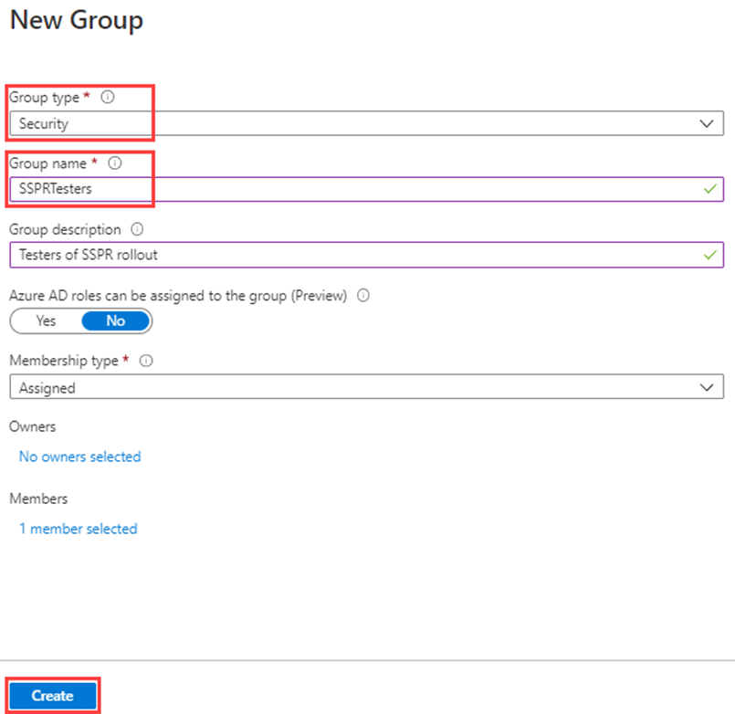
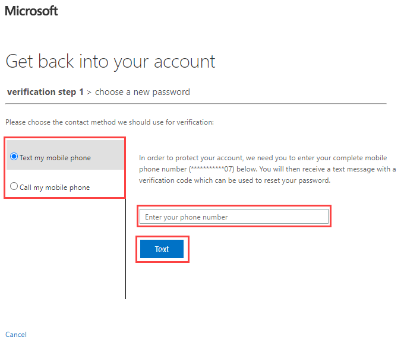

---
lab:
  title: 09 – Habilitar a redefinição de senha por autoatendimento do Microsoft Entra
  learning path: '02'
  module: Module 02 - Implement an Authentication and Access Management Solution
---

# Laboratório 09 – Configurar e implantar a redefinição de senha por autoatendimento
## Cenário do laboratório

A empresa decidiu capacitar os funcionários e habilitar a redefinição de senha por autoatendimento. Você deve configurá-la na sua organização.

#### Tempo estimado: 15 minutos

### Exercício 1 – Criar um grupo com a SSPR habilitada e adicionar usuários a ele

#### Tarefa 1 – Criar um grupo ao qual atribuir a SSPR

Você quer distribuir a SSPR para um conjunto limitado de usuários primeiro para verificar se a configuração da SSPR funciona conforme o esperado. Você irá criar um grupo de segurança para a distribuição limitada e adicionar um usuário ao grupo.

1. No centro de administração do Microsoft Entra, abra o menu de navegação **Identidade** à esquerda.
1. Em **Grupos**, selecione **Todos os grupos** e escolha **Novo Grupo** na janela do lado direito.

2. Crie um novo grupo com as seguintes informações:

    | **Configuração**| **Valor**|
    | :--- | :--- |
    | Tipo de grupo| Segurança|
    | Nome do grupo| SSPRTesters|
    | Descrição do grupo| Usuários de teste da distribuição da SSPR|
    | Tipo de afiliação| Atribuído|
    | Membros| Alex Wilber |
    | |  Allan Deyoung |
    | | Bruna Alves |
  
    
3. Selecione **Criar**.

    

#### Tarefa 2 – Habilitar a SSPR para seu grupo de teste

Habilite a SSPR para o grupo.

1. Navegue de volta para o menu de navegação **Identidade**.

2. Em  **Proteção**, selecione  **Redefinição de senha**.

3. Na página Propriedades da página Redefinição de senha, em **Redefinição de senha por autoatendimento habilitada**, selecione  **Selecionado**.

4. Selecione **Selecionar grupo** e escolha **SSPRSecurityGroupUser**.

5. No painel Política de redefinição de senha padrão, selecione o grupo **SSPRTesters** .

6. Na página Propriedades da página Redefinição de senha, selecione  **Salvar**.

    

7. Na tela **Redefinição de senha**, procure em  **Gerenciar*, selecione e examine os valores padrão para cada uma das **configurações de métodos de autenticação **, ** Registro**, **Notificações** e **Personalização**.

    **Observação** é importante ter **telefone** selecionado como um dos métodos de autenticação para o restante deste laboratório, mas você também pode ter outras opções.

#### Tarefa 3 - Registre-se na SSPR como Alex

Agora que a configuração da SSPR foi concluída, registre um número do telefone celular para o usuário que você criou.

1. Abra um navegador diferente ou uma sessão anônima do navegador e acesse [https://aka.ms/ssprsetup](https://aka.ms/ssprsetup).

    Isso garante que seja solicitada a você a autenticação de usuário.

2. Entre como **AlexW@**`<<organization-domain-name>>.onmicrosoft.com` com a senha = Digite a senha de administrador do locatário (Consulte a guia Recursos de laboratório para recuperar a senha de administrador).

    **Observação** – Substitua organization-domain-name pelo nome do seu domínio.

3. Ao receber uma solicitação de atualização de senha, insira uma nova senha de sua escolha. Não se esqueça de registrar a nova senha.

4. Na caixa de diálogo **Mais informações necessárias**, selecione **Avançar**.

5. Na página Manter sua conta segura, use a opção **Telefone**.

    

    **Observação** – Neste laboratório, você usará a opção **Telefone**. Insira os detalhes de seu celular.

6. Digite seu número de telefone celular pessoal no campo de número de telefone.
7. Selecione  **Enviar um código por SMS**.
8. Selecione **Avançar**.

9. Ao receber o código em seu celular, digite-o na caixa de texto e selecione **Avançar**.

10. Após o telefone ser registrado, selecione **Avançar** e **Concluído**.

11. Feche o navegador. Você não precisa concluir o processo de entrada.

#### Tarefa 4: Testar a SSPR

Agora, vamos testar se o usuário pode redefinir a própria senha.

1. Abra um navegador diferente ou uma sessão anônima do navegador e acesse  [https://portal.azure.com](https://portal.azure.com).

    Isso garante que seja solicitada a você a autenticação de usuário.

2. Digite **AlexW@** `<<organization-domain-name>>.onmicrosoft.com` e selecione **Avançar**.

    **Observação** – Substitua organization-domain-name pelo nome do seu domínio.

3. Na página Inserir senha, selecione **Esqueci minha senha**.

4. Na página Voltar para sua conta, preencha as informações solicitadas e selecione **Avançar**.

    

5. Na tarefa **etapa de verificação 1**, selecione **Enviar SMS para o meu celular**, digite seu número de telefone e clique em **Enviar SMS**.

    

6. Insira seu código de verificação e selecione **Avançar**.

7. Na etapa Escolher nova senha, insira e confirme sua nova senha.  Senha recomendável = **Pass@w.rd1234**.

8. Ao concluir, selecione **Concluir**.

9. Entre como **AlexW** com a nova senha que você criou.

10. Insira seu código de verificação e verifique se você pode concluir o processo de entrada.

11. Depois de terminar, feche o navegador.

#### Tarefa 5 – O que acontece se você escolher um usuário que não esteja no grupo SSPRTesters?

1. Como teste, abra uma nova janela do navegador InPrivate, tente fazer logon no Portal do Azure como GradyA e selecione a opção **Esqueci minha senha**.
