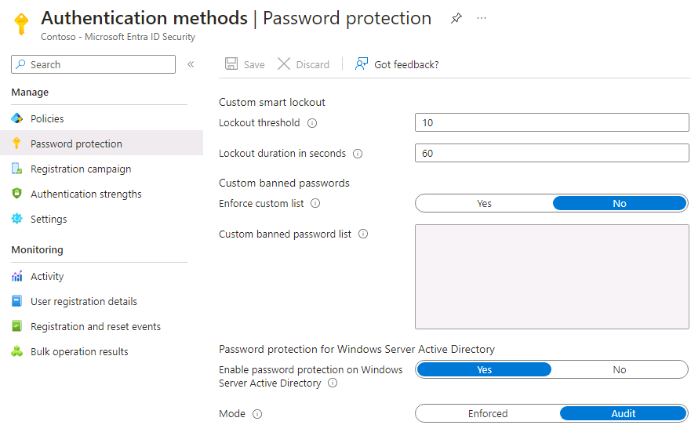

---
lab:
  title: 12 – Gerenciar valores de bloqueio inteligente do Microsoft Entra
  learning path: '02'
  module: Module 02 - Implement an Authentication and Access Management Solution
---

# Laboratório 12 – Gerenciar os valores de bloqueio inteligente do Microsoft Entra

## Cenário do laboratório

Você deve definir as configurações adicionais de proteção de senha para sua organização.

#### Tempo estimado: 5 minutos

### Exercício 1 – Gerenciar os valores de bloqueio inteligente do Microsoft Entra

#### Tarefa - Adicionar bloqueios inteligentes

Com base em seus requisitos organizacionais, você pode personalizar os valores do bloqueio inteligente do Microsoft Entra. A personalização das configurações de bloqueio inteligente, com valores específicos para sua organização, exige licenças do Microsoft Entra ID Premium P1 ou superiores para seus usuários.

1. Navegue até [https://entra.microsoft.com](https://entra.microsoft.com) e entre usando uma conta de Administrador global para o diretório.

2. Abra o menu do portal e selecione  **Identidade**.

3. No menu Identidade, abra o menu **Proteção** .

4. Na navegação à esquerda, selecione **Métodos de autenticação**.

5. E clique em **Proteção de Senha**.

    

6. Nas configurações da Proteção de senha, na caixa **Duração do bloqueio em segundos**, defina o valor como **120**.

7. Ao lado de **Modo**, selecione **Imposto**.

8. Salve suas alterações.

    **OBSERVAÇÃO** – Quando o limite do bloqueio inteligente for acionado, você receberá a seguinte mensagem enquanto a conta estiver bloqueada:
    - Sua conta está temporariamente bloqueada para impedir o uso não autorizado. Tente novamente mais tarde e, se ainda tiver problemas, entre em contato com o administrador.

9. Isso pode ser testado escolhendo um usuário em seu locatário do Microsoft Entra, acessando em um navegador privado <login.microsoftonline.com> e inserindo uma senha incorreta até que a conta receba a notificação de que está bloqueada.
