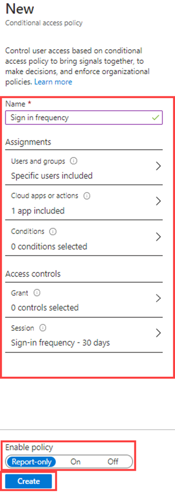

---
lab:
  title: 13 – Implementar e testar uma política de acesso condicional
  learning path: '02'
  module: Module 02 - Implement an Authentication and Access Management Solution
---

# Laboratório 13 – Implementar e testar uma política de acesso condicional

## Cenário do laboratório

Sua organização precisa ser capaz de limitar o acesso do usuário a seus aplicativos internos. Você deve implantar uma política de acesso condicional do Microsoft Entra.

**Observação** - Para políticas de acesso condicional, você pode desativar os Padrões de Segurança, os principais pontos a serem lembrados são do treinamento.  Informações adicionais sobre padrões de segurança podem ser encontradas neste link: <https://docs.microsoft.com/en-us/azure/active-directory/fundamentals/concept-fundamentals-security-defaults>

#### Tempo estimado: 30 minutos

### Exercício 1: Definir uma política de acesso condicional para impedir que o DebraB acesse o Sway

#### Tarefa 1 – Confirmar se o DebraB tem acesso ao Sway

1. Inicie uma nova janela do navegador InPrivate.
2. Conectar-se a [https://www.office.com](https://www.office.com) 
3. Quando solicitado, faça login como DebraB:

   | Configuração | Valor |
   | :--- | :--- |
   | Nome de Usuário | **DebraB@**`<<your lab domain>>.onmicrosoft.com` |
   | Senha | Insira a senha de administrador do locatário (Consulte a guia Recursos de laboratório para recuperar a senha de administrador do locatário). |
    
4. Selecione no ícone **Sway** para ver se ele é carregado corretamente.

#### Tarefa 2 - – Criar uma política de acesso condicional

O acesso condicional do Microsoft Entra é um recurso avançado do Microsoft Entra ID que permite especificar políticas detalhadas que controlam quem pode acessar seus recursos. Ao usar o Acesso condicional, você pode proteger seus aplicativos ao limitar o acesso de usuários com base em especificações como grupos, tipo de dispositivo, local e função.

1. Navegue até [https://entra.microsoft.com](https://entra.microsoft.com) e entre usando uma conta de Administrador global para o diretório.

2. Abra o menu do portal e selecione  **Microsoft Entra ID**.

3. No menu Identidade, em **Identidade**, selecione **Proteção**.

4. Na página Segurança, na navegação à esquerda, selecione **Acesso condicional**.

5. Na **Visão geral (Visualização)**, clique em **+ Criar nova política**.

   

6. Na caixa **Nome**, digite **Bloquear o Sway para o DebraB**.

   **Observação** – Usando essa nomenclatura para ajudar você a reconhecer rapidamente a política e sua função.

7. Em **Atribuições**, selecione **0 usuários e grupos selecionados**.

8. Na guia Incluir, escolha **Selecionar usuários e grupos** e marque a caixa **Usuários e grupos**.

9. No painel Selecionar, selecion a conta do **DebraB** e depois **Selecionar**.

10. Em **Recursos de destino**, selecione **Nenhum recurso de destino selecionado**.

11. Verifique se **os aplicativos na nuvem** estão selecionados e, em seguida, selecione **Selecionar aplicativos** e, em seguida, selecione **Nenhum** na seção de seleção.

12. No painel Selecionar, procure **Sway**, selecione **Sway** e, em seguida, selecione **Selecionar**.

13. Em **Controles de acesso**, na sessão **Conceder**, selecione **0 controles selecionados**.

14. No painel Conceder, selecione **Bloquear acesso** e depois **Selecionar**.

   **Observação** – Essa política está sendo configurada apenas para este exercício e está sendo usada para demonstrar rapidamente uma política de acesso condicional.

15. Em **Habilitar política**, selecione **Ativa** e selecione **Criar**.

   

#### Tarefa 3 – Testar a política de acesso condicional

Você deve testar suas políticas de acesso condicional para garantir que elas estejam funcionando conforme o esperado.

1. Abra uma nova guia do navegador "InPrivate" e navegue até [https://sway.office.com](https://sway.office.com).
    - Quando solicitado, faça login como DebraB:

   | Configuração | Valor |
   | :--- | :--- |
   | Nome de Usuário | **DebraB@**`<<your lab domain>>.onmicrosoft.com` |
   | Senha | Insira a senha de administrador do locatário (Consulte a guia Recursos de laboratório para recuperar a senha de administrador do locatário). |
     
2. Verifique se você pode acessar o Microsoft Sway.

   

3. Caso tenha se conectado, feche a guia, aguarde 1 minuto e tente novamente.
    
   **Observação**: se você estiver conectado automaticamente ao Sway como DebraB, precisará fazer logon manualmente.  Suas credenciais/acesso foram armazenados em cache.  Depois que você fizer logon e entrar, sua sessão do Sway deverá negar o acesso.

4. Feche a guia e retorne à página Acesso condicional.

5. Selecione a política **Bloquear o Sway para DebraB**.

6. Em **Habilitar política**, selecione **Desativar** e depois **Salvar**.

### Exercício 2 – Testar políticas de acesso condicional com o teste de hipóteses

#### Vídeo: Usar o de teste de hipóteses para testar políticas de acesso condicional

1. Abra o menu do centro de administração do Microsoft Entra e selecione  **Microsoft Entra ID**.

1. No menu Identidade, em **Identidade**, selecione **Proteção**.

1. Na página Segurança, na navegação à esquerda, selecione **Acesso condicional**.

1. No painel de navegação, selecione **Políticas**.

1. Selecione **What If**.

1. Em **Identidade de usuário ou carga de trabalho**, selecione **Nenhum usuário ou entidade de serviço selecionado**.

1. Escolha **DebraB** como usuário.

1. Em **Contexto de aplicativos de nuvem, de ações ou de autenticação**, selecione **Sway**. 

1. Selecione **What if**. Você veráum relatório na parte inferior do bloco para **Políticas que serão aplicadas** e **Políticas que não serão aplicadas**.

Isso permite que você teste as políticas e sua afetividade antes de habilitá-las.

### Exercício 3 – Configurar controles de frequência de entrada usando uma política de acesso condicional

#### Tarefa – Usar o centro de administração do Microsoft Entra para configure o acesso condicional.

Como parte da configuração de segurança maior da sua empresa, você deve testar uma política de acesso condicional que pode ser usada para controlar a frequência de entrada

1. Navegue até [https://entra.microsoft.com](https://entra.microsoft.com) e entre usando uma conta de Administrador global para o diretório.

2. Abra o menu do portal e selecione  **Microsoft Entra ID**.

3. No menu Identidade, em **Identidade**, selecione **Proteção**.

4. No menu Proteção, na navegação à esquerda, selecione **Acesso condicional**.

5. No menu superior, selecione **+ Nova política**. Na lista suspensa, selecione **Criar nova política**.

   

6. Na caixa **Nome**, insira a **Frequência de entrada**.

7. Em **Atribuições**, selecione **0 usuários e grupos selecionados**.

8. Na guia Incluir, escolha **Selecionar usuários e grupos** e selecione a caixa de seleção **Usuários e grupos**.

9. No painel Selecionar, selecione sua conta **Grady Archie** e clique em **Selecionar**.

10. Selecione **Aplicativos na nuvem ou ações**.

11. Verifique se **Aplicativos de nuvem** está selecionado e selecione **Selecionar aplicativos**.

12. No painel Selecionar, selecione **Office 365** e depois **Selecionar**.

13. Em **Controles de acesso**, selecione **Sessão**.

14. No painel Sessão, selecione **Frequência de entrada**.

15. Na caixa de valor, insira **30**.

16. Selecione o menu unidades, depois **Dias** e, por fim, **Selecionar**.

17. Em **Habilitar política**, selecione **Somente relatório** e depois **Criar**.

   

   **OBSERVAÇÃO** – O modo somente relatório é um novo estado de política de Acesso condicional que permite aos administradores avaliar o impacto das políticas de Acesso condicional antes de habilitá-las em seu ambiente. Com a versão do modo somente relatório:
    
- As políticas de Acesso condicional podem ser habilitadas no modo somente relatório.
- Durante a entrada, as políticas no modo somente relatório são avaliadas, mas não impostas.
- Os resultados são registrados nas guias Acesso Condicional e Somente relatórios dos detalhes do log de entrada.
- Os clientes com uma assinatura do Azure Monitor podem monitorar o impacto de suas políticas de Acesso condicional usando a pasta de trabalho de informações de Acesso condicional.
