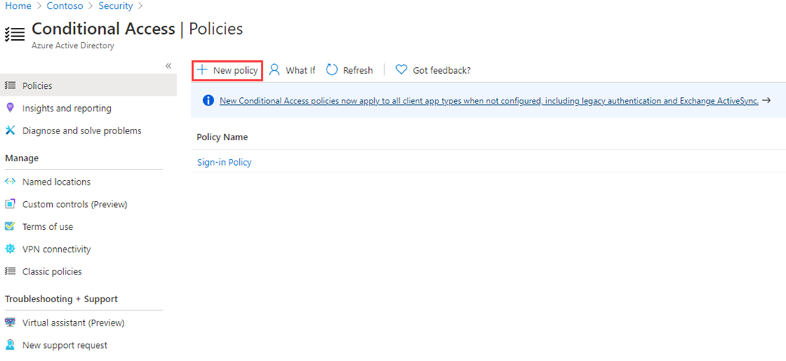

---
lab:
  title: 13 - Implementar e testar uma política de acesso condicional
  learning path: '02'
  module: Module 02 - Implement an Authentication and Access Management Solution
---

# Laboratório 13 - Implementar e testar uma política de acesso condicional

## Cenário do laboratório

Sua organização precisa ser capaz de limitar o acesso do usuário a seus aplicativos internos. Você deve implantar uma política de acesso condicional do Azure Active Directory.

**Observação** - Para Políticas de Acesso Condicional, você pode desativar os Padrões de segurança. Os principais pontos a serem lembrados são do treinamento.  Informações adicionais sobre Padrões de segurança podem ser encontradas neste link: <https://docs.microsoft.com/en-us/azure/active-directory/fundamentals/concept-fundamentals-security-defaults>

#### Tempo previsto: 30 minutos

### Exercício 1 - Definir uma política de acesso condicional para impedir que o DebraB acesse o Yammer

#### Tarefa 1 -- Confirmar que o DebraB tem acesso ao Yammer

1. Abra uma nova janela anônima do navegador.
2. Conectar-se a [https://www.office.com](https://www.office.com) 
3. Quando solicitado, faça login como DebraB:

   | Configuração | Valor |
   | :--- | :--- |
   | Nome de Usuário | **** DebraB@ `<<your lab domain>>.onmicrosoft.com` |
   | Senha | Insira a senha de administrador do locatário(Consulte a guia Recursos de laboratório para recuperar a senha de administrador do locatário). |
    
4. Selecione o ícone do Yammer para ver se ele é carregado corretamente.

#### Tarefa 2 - Criar uma política de acesso condicional

O acesso condicional do Azure Active Directory é um recurso avançado do Azure AD que permite que você especifique políticas detalhadas que controlam quem pode acessar seus recursos. Ao usar o Acesso condicional, você pode proteger seus aplicativos ao limitar o acesso de usuários com base em especificações como grupos, tipo de dispositivo, local e função.

1. Navegue até o [https://portal.azure.com](https://portal.azure.com) e entre usando uma conta de administrador global para o diretório.

2. Abra o menu do portal e selecione  **Azure Active Directory**.

3. Na página do Azure Active Directory, em **Gerenciar**, selecione **Segurança**.

4. Na página Segurança, na navegação à esquerda, selecione **Acesso condicional**.

5. Na **Visão geral (Visualização),** clique em **+Criar nova política**.

   

6. Na caixa **Nome**, insira os **Bloquear Yammer para DebraB**.

   **Observação** - Usando essa nomenclatura para ajudá-lo a reconhecer rapidamente a política e sua função.

7. Em **Atribuições**, selecione **Usuários ou identidades de carga de trabalho**.

8. Na guia Incluir, marque a caixa de seleção **Usuários e grupos**.

9. No painel Selecionar, escolha a conta **DebraB** e depois **Selecionar**.

10. Selecione **Aplicativos na nuvem ou ações**.

11. Verifique se **Aplicativos de nuvem** está selecionado e selecione **Selecionar aplicativos**.

12. No painel Selecionar, procure **Yammer** e selecione **Office 365 Yammer** e depois **Selecionar**.

13. Em **Controles de acesso**, selecione **Conceder**.

14. No painel Conceder, selecione **Bloquear acesso** e depois **Selecionar**.

   **Observação** - Essa política é configurada apenas para este exercício e é usada para demonstrar rapidamente uma política de acesso condicional.

15. Em **Habilitar política**, selecione **Ativa** e selecione **Criar**.

   

#### Tarefa 3 - Testar a política de acesso condicional

Você deve testar suas políticas de acesso condicional para garantir que elas estejam funcionando conforme o esperado.

1. Abra uma nova guia anônima do navegador e navegue até [https://www.yammer.com/office365](https://www.yammer.com/office365).
    - Quando solicitado, faça login como DebraB:

   | Configuração | Valor |
   | :--- | :--- |
   | Nome de Usuário | **** DebraB@ `<<your lab domain>>.onmicrosoft.com` |
   | Senha | Insira a senha de administrador do locatário(Consulte a guia Recursos de laboratório para recuperar a senha de administrador do locatário). |
     
2. Verifique se você está impedido de acessar com êxito o Microsoft Yammer.

   

3. Caso esteja conectado, feche a guia, aguarde de 1 minuto e tente novamente.
    
   **Observação** - Se você estiver conectado automaticamente ao Yammer como DebraB, será necessário fazer logout manualmente.  Suas credenciais/acessos foram armazenados em cache.  Depois de terminar e iniciar sessão, a sua sessão do Yammer deve negar o acesso.

4. Feche a guia e retorne à página Acesso condicional.

5. Selecione a política **Acesso condicional do Yammer**.

6. Em **Habilitar política**, selecione **Desativar** e depois **Salvar**.

### Exercício 2 - Testar políticas de acesso condicional com "E se”

#### Tarefa - Usar “E se” para testar políticas de acesso condicional

1. Abra o menu do portal e selecione  **Azure Active Directory**.

1. Na página do Azure Active Directory, em **Gerenciar**, selecione **Segurança**.

1. Na página Segurança, na navegação à esquerda, selecione **Acesso condicional**.

1. No painel de navegação, escolha **Políticas**.

1. Selecione **E se**.

1. Em **Usuário ou identidade de carga de trabalho**, selecione **Nenhum usuário ou entidade de serviço selecionado**.

1. Escolha **DebraB** como usuário.

1. Em **Aplicativos de nuvem, ações ou contexto de autenticação**, selecione **Yammer**. 

1. Selecione **E se**. Você receberá um relatório na parte inferior do bloco para **Políticas que serão aplicadas** e **Políticas que não serão aplicadas**.

Isso permite que você teste as políticas e sua afetividade antes de habilitá-las.

### Exercício 3 - Configurar controles de frequência de entrada usando uma política de acesso condicional

#### Tarefa - Usar o Portal do Azure para configurar o acesso condicional

Como parte da configuração de segurança maior da sua empresa, você deve testar uma política de acesso condicional que pode ser usada para controlar a frequência de entrada

1. Navegue até o [https://portal.azure.com](https://portal.azure.com) e entre usando uma conta de administrador global para o diretório.

2. Abra o menu do portal e selecione  **Azure Active Directory**.

3. Na página do Azure Active Directory, em **Gerenciar**, selecione **Segurança**.

4. Na página Segurança, na navegação à esquerda, selecione **Acesso condicional**.

5. No menu superior suspenso selecione **+ Nova política** e **Criar política**.

   

6. Na caixa **Nome**, insira a **Frequência de entrada**.

7. Em **Atribuições**, selecione **Usuários ou identidades de carga de trabalho**.

8. Na guia Incluir, marque a caixa de seleção **Usuários e grupos**.

9. No painel Selecionar, escolha sua conta **Grady Archie** e depois **Selecionar**.

10. Selecione **Aplicativos na nuvem ou ações**.

11. Verifique se **Aplicativos de nuvem** está selecionado e selecione **Selecionar aplicativos**.

12. No painel Selecionar, selecione **Office 365** e depois **Selecionar**.

13. Em **Controles de acesso**, selecione **Sessão**.

14. No painel Sessão, selecione **Frequência de entrada**.

15. Na caixa de valor, insira **30**.

16. Selecione o menu unidades, depois **Dias** e, por fim, **Selecionar**.

17. Em **Habilitar política**, selecione **Somente relatório** e depois **Criar**.

   

   **Observação** - O modo somente relatório é um novo estado de política de Acesso condicional que permite aos administradores avaliar o impacto das políticas de Acesso condicional antes de habilitá-las em seu ambiente. Com a versão do modo somente relatório:
    
- As políticas de Acesso condicional podem ser habilitadas no modo somente relatório.
- Durante a entrada, as políticas no modo somente relatório são avaliadas, mas não impostas.
- Os resultados são registrados nas guias Acesso Condicional e Somente relatórios dos detalhes do log de entrada.
- Os clientes com uma assinatura do Azure Monitor podem monitorar o impacto de suas políticas de Acesso condicional usando a pasta de trabalho de informações de Acesso condicional.
