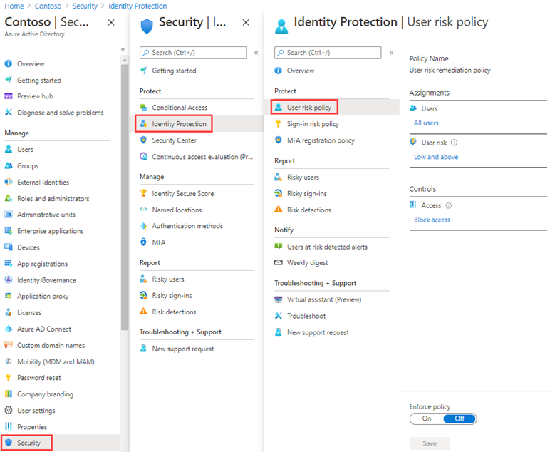

---
lab:
  title: 14 – Habilitar as políticas de risco do usuário e de entrada
  learning path: '02'
  module: Module 02 - Implement an Authentication and Access Management Solution
---

# Laboratório 14 – Habilitar políticas de risco do usuário e de entrada

## Cenário do laboratório

Como uma camada adicional de segurança, você precisa habilitar e configurar as políticas de risco do usuário e de entrada da sua organização do Microsoft Entra.

#### Tempo estimado: 10 minutos

### Exercício 1 – Habilitar política de risco do usuário

#### Tarefa 1 – Configurar a política

1. Entre no  [https://entra.microsoft.com]( https://entra.microsoft.com) usando uma Conta de administrador global.

2. Abra o menu do portal e selecione  **Microsoft Entra ID**.

3. No menu à esquerda, em **Identidade**, selecione **Proteção**.

4. Na página Segurança, na navegação à esquerda, selecione **Proteção de identidade**.

5. Na página Proteção de identidade, na navegação à esquerda, selecione **Política de risco do usuário**.

    

6. Em **Atribuições**, selecione **Todos os usuários** e examine as opções disponíveis.

7. Você pode selecionar de **Todos os usuários** ou **Selecionar indivíduos e grupos,** se limitar a distribuição.

8. Além disso, você pode optar por excluir usuários da política.

9. Em **Risco do usuário**, selecione **Baixo e superior**.

10. No painel Risco do usuário, selecione **Alto** e, em seguida, selecione **Concluído**.

11. Em **Controles** > **Acesso**, selecione **Bloquear acesso**.

12. No painel de acesso, examine as opções disponíveis.

    **Dica** – A recomendação da Microsoft é permitir o acesso e exigir alteração de senha.

13. Selecione a caixa de seleção **Exigir alteração de senha** e depois selecione **Concluído**.

14. Em **Imposição de política**, selecione **Ativado** e clique em **Salvar**.

#### Tarefa 2 – Habilitar Política de risco de entrada

1. Na página Proteção de identidade, na navegação à esquerda, selecione **Política de risco de entrada**.

2. Assim como acontece com a política de Risco do usuário, a política de risco de entrada pode ser atribuída a usuários e grupos e permite que você exclua os usuários da política.

3. Em **Risco de entrada**, selecione **Baixo e superior**.

4. No painel Risco de entrada, selecione **Alto** e, em seguida, selecione **Concluído**.

5. Em **Controles** > **Acesso**, selecione **Bloquear acesso**.

6. Marque a caixa de seleção **Exigir autenticação multifator** e, em seguida, selecione **Concluído**.

7. Em **Imposição de política**, selecione **Ativado** e clique em **Salvar**.
