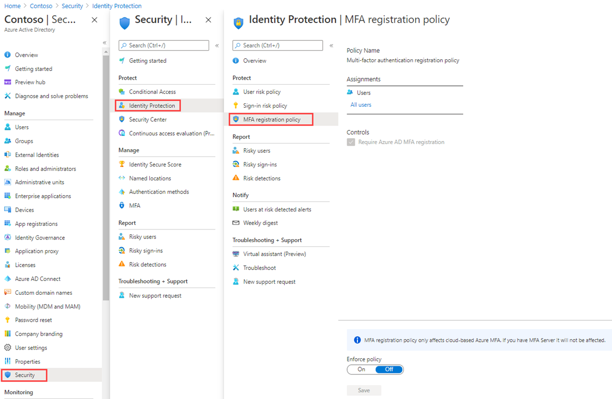

---
lab:
  title: 15 – Configurar uma política de registro com autenticação multifator
  learning path: '02'
  module: Module 02 - Implement an Authentication and Access Management Solution
---

# Laboratório15 – Configurar a política de registro com autenticação multifator

## Cenário do laboratório

A autenticação multifator fornece um meio de verificar quem você é usando mais do que apenas um nome de usuário e senha. Ela oferece uma segunda camada de segurança para entradas de usuário. Para que os usuários possam responder aos prompts da MFA, eles devem primeiro se registrar na autenticação multifator do Microsoft Entra. Você deve configurar a política de registro com MFA da organização do Microsoft Entra para ser atribuída a todos os usuários.

#### Tempo estimado: 10 minutos

### Exercício 1 – Configurar a política de registo com AMF

#### Tarefa 1 – Configuração da política

1. Entre no  [https://entra.microsoft.com]( https://entra.microsoft.com) usando uma Conta de administrador global.

2. Abra o menu do portal e selecione  **Microsoft Entra ID**.

3. No menu esquerdo, em **Identidade**, selecione **Proteção**.

4. Na página Segurança, na navegação à esquerda, selecione **Proteção de identidade**.

5. Na página Proteção de identidade, na navegação à esquerda, em **Proteger**, selecione **Política de registro com autenticação multifator**.

    

6. Em **Atribuições**

7. Em **Atribuições**, selecione **Todos os usuários** e examine as opções disponíveis.

8. Você pode selecionar de **Todos os usuários** ou **Selecionar indivíduos e grupos,** se limitar a distribuição.

9. Além disso, você pode optar por excluir usuários da política.

10. Em **Controles**, observe que **Exigir registro de autenticação multifator do Microsoft Entra ID** está selecionado e isso não pode ser alterado.

#### Tarefa 2 – Configurar a política do Microsoft Entra Identity Protection para registro com MFA

**Observação**: o Microsoft Entra Identity Protection requer que o Microsoft Entra ID Premium P2 seja ativado. 

1. No Centro de administração do Microsoft Entra, navegue até **Microsoft Entra Identity Protection** na barra de pesquisa.

1. Em **Proteger** no menu, selecione **Política de registro com autenticação multifator**.

1. Em **Atribuições**, selecione **Todos os usuários** em Usuários e selecione um usuário para aplicar a MFA.

1. Altere a **Aplicação da política** de **Desativada** para **Ativada**.

1. Selecione **Salvar**.

Isso exigirá que o usuário conclua o registro com MFA na próxima vez que tentar fazer logon.

1. Em um navegador privado, navegue até `https://login.microsoftonline.com`. Insira o nome de usuário e uma senha pelo locatário.  Atente-sea os requisitos adicionais de informações de segurança que o usuário deve inserir.
