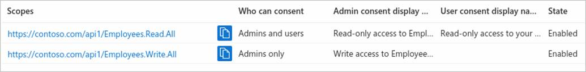

---
lab:
  title: 19 – Registrar um aplicativo
  learning path: '03'
  module: Module 03 - Implement Access Management for Apps
---

# Laboratório 19 – Registrar um aplicativo

### Tipo de logon = administração do Microsoft 365

#### Tempo estimado: 30 minutos

### Exercício 1 – Registrar um aplicativo

#### Tarefa 1 – Registro de aplicativo

Registrar seu aplicativo estabelece uma relação de confiança entre seu aplicativo e a plataforma de identidade da Microsoft. A confiança é unidirecional: seu aplicativo confia na plataforma de identidade da Microsoft, e não o contrário.

1. Faça login em [https://entra.microsoft.com](https://entra.microsoft.com) usando uma conta de Administrador global.

2. Abra o menu do portal e selecione  **Microsoft Entra ID**.

3. No menu **Identidade**, em **Aplicativos**, selecione **Registros de aplicativos**.

4. Na página **Registros de aplicativo**, no menu, selecione **+ Novo registro**.

5. No painel **registrar um aplicativo**, registre um aplicativo chamado **Aplicativo de demonstração** usando os valores padrão. Não é preciso inserir o URI de redirecionamento.

    

6. Selecione o botão **Registrar**.

7. Ao concluir, você será direcionado para a página **Aplicativo de demonstração**.

#### Tarefa 2 – Definir configurações da plataforma

As configurações para cada tipo de aplicativo, incluindo URIs de redirecionamento, são definidas em  **Configurações da plataforma**  no portal do Azure. Algumas plataformas, como **Web** e **Aplicativos de página única**, exigem que você especifique manualmente um URI de redirecionamento. Para outras plataformas, como dispositivos móveis e desktop, você pode selecionar entre URIs de redirecionamento gerados para você ao definir as outras configurações.

Para definir as configurações do aplicativo com base na plataforma ou no dispositivo que você está direcionando:

Adicione e modifique URIs de redirecionamento para seus aplicativos registrados configurando suas definições de plataforma.

1. Selecione seu aplicativo em  **Registros de aplicativos** no centro de administração do Microsoft Entra.

2. Em  **Gerenciar**, selecione  **Autenticação**.

3. Em  **Configurações da plataforma**, selecione  **+ Adicionar uma plataforma**.

4. Em  **Configurar plataformas**, selecione o bloco do seu tipo de aplicativo (plataforma) para definir suas configurações.

    

    | Plataforma| Definições de configuração|
    | :--- | :--- |
    | Web| Insira um  **URI de redirecionamento** para seu aplicativo, o local onde a plataforma de identidade da Microsoft redireciona o cliente de um usuário e envia tokens de segurança após a autenticação. Selecione essa plataforma para aplicativos Web padrão que são executados em um servidor.|
    | Aplicativo de página única| Insira um  **URI de redirecionamento** para seu aplicativo, o local onde a plataforma de identidade da Microsoft redireciona o cliente de um usuário e envia tokens de segurança após a autenticação. Selecione esta plataforma se você está criando um aplicativo Web do lado do cliente em JavaScript ou com uma estrutura como Angular, Vue.js, React.js ou Blazor WebAssembly.|
    | iOS/macOS| Insira a  **ID do pacote** do aplicativo, encontrado no XCode em  *Info.plist*  ou Configurações de build. Um URI de redirecionamento é gerado para você quando você especifica uma ID do Pacote.|
    | Android| Insira o  **Nome do pacote** do aplicativo, que você pode encontrar no arquivo AndroidManifest.xml, e gere e insira o  **Hash de assinatura**. Um URI de redirecionamento é gerado para você quando você especifica essas configurações.|
    | Aplicativos móveis e para desktop| Selecione um dos  **URIs de redirecionamento sugeridos**  ou especifique um  **URI de redirecionamento personalizado**. Para aplicativos de desktop, recomendamos: [https://login.microsoftonline.com/common/oauth2/nativeclient](https://login.microsoftonline.com/common/oauth2/nativeclient). Selecionar essa plataforma para aplicativos móveis que não estão usando a MSAL (Biblioteca de Autenticação da Microsoft) mais recente ou que não estão usando um agente. Selecione também essa plataforma para aplicativos de desktop.|

5. Selecione **Web** como sua plataforma.

6. Insira `https://localhost` como o URI de Redirecionamento.

7. Selecione  **Configurar** para concluir a configuração da plataforma.

#### Tarefa 3 – Adicionar credenciais, certificado e segredo do cliente

As credenciais são usadas por aplicativos cliente confidenciais que acessam uma API Web. O aplicativos Web, outras APIs da Web e aplicativos de tipo de serviço e de daemon são exemplos de clientes confidenciais. As credenciais permitem que seu aplicativo se autentique como ele mesmo, sem nenhuma interação com um usuário no runtime.

Você pode adicionar certificados e segredos do cliente (uma cadeia de caracteres) como credenciais ao registro do aplicativo cliente confidencial.


    **Note**: Sometimes called a *public key*, certificates are the recommended credential type, because as they provide a higher level of assurance than a client secret. When using a trusted public certificate, you can add the certificate using the Certificates & secrets feature. Your certificate must be one of the following file types: .cer, .pem, .crt.


    **Note**: The client secret, also known as an *application password*, is a string value your app can use in place of a certificate to identity itself. It's the easier of the two credential types to use. It's often used during development, but is considered less secure than a certificate. You should use certificates in your applications running in production.

1. Selecione seu aplicativo em  **Registros de aplicativo** no portal do Azure.

2. Em  **Certificados e segredos**, selecione  **+ Novo segredo do cliente**.

3. Adicione uma descrição para o segredo do cliente e duração.

 - Descrição = segredo do laboratório SC300
 - Duração = 90 dias (3 meses)

4. Selecione **Adicionar**.

5. **Salve o valor do segredo no bloco de notas** para uso no código do aplicativo cliente; A página Certificado e segredos exibirá o novo valor de segredo. É importante copiar esse valor, pois ele é mostrado apenas uma vez. Se você sair da página e voltar, ela apenas mostrará como um valor mascarado.

Com o aplicativo Web registrado, você já pode adicionar os escopos que o código da API pode usar para fornecer permissão granular aos consumidores de sua API.

#### Tarefa 5 – Adicionar um escopo

O código em um aplicativo cliente solicita permissão para executar operações definidas por sua API Web passando um token de acesso junto com suas solicitações para o recurso protegido (a API Web). A API Web executará a operação solicitada somente se o token de acesso recebido contiver os escopos (também conhecidos como permissão de aplicativo) necessários para a operação.

Primeiro, siga estas etapas para criar um escopo de exemplo chamado Employees.Read.All:

1. Selecione  **Identidade**, depois **Aplicativo** e, por fim, selecione **Registros de aplicativo** e o registro de aplicativo da sua API.

2. Selecione  **Expor uma API**, depois  **+ Adicionar um escopo**.

    

3. Será solicitado que você defina um  **URI de ID do aplicativo**. Defina o valor como **api://DemoAppAPI**

  - Observação – O URI da ID do aplicativo atua como o prefixo dos escopos que você referenciará no código da API e deve ser globalmente exclusivo. Você pode usar o valor padrão fornecido, que está no formato api://<application-client-id\>, ou especificar um URI mais legível, como  `https://contoso.com/api`.

4. Selecione **Salvar e continuar**.

5. Em seguida, especifique os atributos do escopo no  **painel Adicionar um escopo**. Para este passo a passo, use os valores da terceira coluna – **Valor**.

    | Campo| Descrição| Valor |
    | :--- | :--- | :--- |
    | Nome do Escopo| O nome do seu escopo. Uma convenção comum de nomenclatura de escopo é resource.operation.constraint.| Employees.Read.All|
    | Quem pode consentir| Se esse escopo pode ser consentido por usuários ou se é necessário ter o consentimento do administrador. Selecione Somente administradores para permissões com privilégios mais elevados.| Administradores e usuários|
    | Nome de exibição de consentimento do administrador| Uma breve descrição da finalidade do escopo que somente os administradores verão.| Acesso somente leitura aos registros de funcionários|
    | Descrição do consentimento do administrador| Uma descrição mais detalhada da permissão concedida pelo escopo que somente os administradores verão.| Permitir que o aplicativo tenha acesso somente leitura a todos os dados de funcionários.|
    | Nome para exibição do consentimento do usuário| Uma breve descrição da finalidade do escopo. Mostrado para os usuários somente se você definir Quem pode consentir como Administradores e usuários.| Acesso somente leitura aos registros de funcionários|
    | Descrição de consentimento do usuário| Uma descrição mais detalhada da permissão concedida pelo escopo. Mostrado para os usuários somente se você definir Quem pode consentir como Administradores e usuários.| Permitir que o aplicativo tenha acesso somente leitura aos dados de funcionários.|

7. Defina o  **Estado**  como  **Habilitado** e selecione  **Adicionar escopo**.

8. (Opcional) Para suprimir a solicitação de consentimento dos usuários do seu aplicativo para os escopos que você definiu, você pode  *pré-autorizar*  o aplicativo cliente a acessar sua API Web. Pré-autorize  *apenas*  aplicativos cliente confiáveis, pois os usuários não terão a oportunidade de recusar o consentimento.

   1. Em  **Aplicativos cliente autorizados**, selecione  **Adicionar um aplicativo cliente**.

   2. Insira a  **ID do Aplicativo (cliente)**  do aplicativo cliente que deseja pré-autorizar. Por exemplo, aquela de um aplicativo Web que você já registrou.

   3. Em  **Escopos autorizados**, selecione os escopos para os quais deseja suprimir a solicitação de consentimento e escolha  **Adicionar aplicativo**.

   4. Se você seguiu essa etapa opcional, o aplicativo cliente agora é um PCA (aplicativo cliente pré-autorizado), e não será solicitado o consentimento dos usuários ao entrar nele.

#### Tarefa 6 – Adicionar um escopo que requer o consentimento do administrador

Em seguida, adicione outro escopo de exemplo chamado Employees.Write.All, que somente os administradores podem consentir. Os escopos que exigem consentimento do administrador normalmente são usados para fornecer acesso a operações com maior privilégio, muitas vezes, por aplicativos cliente executados como serviços de back-end ou daemons que não conectam um usuário interativamente.

1. Para adicionar o escopo de exemplo Employees.Write.All, siga as etapas acima e especifique esses valores no painel  **Adicionar um escopo** :

    | Campo| Valor de exemplo|
    | :--- | :--- |
    | Nome do escopo| Employees.Write.All|
    | Quem pode consentir| Somente administradores|
    | Nome de exibição de consentimento do administrador| Gravação de acesso aos registros de funcionários|
    | Descrição do consentimento do administrador| Permitir que o aplicativo tenha acesso de gravação a todos os dados de funcionários.|
    | Nome para exibição do consentimento do usuário| Nenhum (deixe em branco)|
    | Descrição de consentimento do usuário| Nenhum (deixe em branco)|

2. Confirme se o Estado está como **Habilitado** e clique em **Adicionar escopo**.

  - **Observação**: se você tiver adicionado com êxito os dois escopos de exemplo descritos nas seções anteriores, eles aparecerão no painel  **Expor uma API** do registro de aplicativo da API Web, semelhante a esta imagem:

  

  Conforme mostrado na imagem, a cadeia de caracteres completa de um escopo é a concatenação do  **URI da ID do Aplicativo**  da sua API Web e o  **Nome do escopo**.

  **Observação**: Por exemplo, se o URI da ID do aplicativo da API Web for `https://contoso.com/api` e o nome do escopo for Employees.Read.All, o escopo completo será: `https://contoso.com/api/Employees.Read.All`

  **Observação**: Em seguida você vai configurar o registro de um aplicativo cliente com acesso à API Web e os escopos definidos seguindo as etapas acima.
  Depois que um registro de aplicativo cliente recebe permissão para acessar sua API Web, o cliente pode receber um token de acesso OAuth 2.0 pela plataforma de identidade da Microsoft. Quando o cliente chama a API Web, ele apresenta um token de acesso cuja declaração de escopo (scp) é definida como as permissões que você especificou no registro de aplicativo do cliente. É possível expor escopos adicionais posteriormente conforme a necessidade. Considere que sua API Web pode expor vários escopos associados a diversas operações. O recurso pode controlar o acesso a API Web em runtime avaliando declarações de escopo (scp) no token de acesso OAuth 2.0 recebido.


### Exercício 2 –⁠ Gerenciar o registro de aplicativo com uma função personalizada

#### Tarefa 1 – Criar uma nova função personalizada para permitir acesso para gerenciar registros de aplicativo

Você precisa criar uma nova função personalizada para o gerenciamento de aplicativos. Essa nova função deve ser limitada apenas às permissões específicas necessárias para executar o gerenciamento de credenciais.

1. Faça logon em  [https://entra.microsoft.com](https://entra.microsoft.com) usando uma Conta de administrador global.

2. Abra o menu do portal e selecione  **Microsoft Entra ID**.

3. No menu esquerdo, em **Identidade**, selecione **Funções e administradores**.

4. Em seguida, selecione **Funções e item de administradores** e, em seguida, selecione **+ Nova função personalizada**.

    

5. Na caixa de diálogo Nova função personalizada, na guia Noções básicas, na caixa de nome, insira **Minha função de aplicativo personalizada**.

6. Examine as opções restantes e selecione **Avançar**.

7. Na guia Permissões, examine as permissões disponíveis.

8. Na caixa **Pesquisar por nome da permissão ou descrição**, insira as **credenciais**.

9. Nos resultados, selecione as permissões **Gerenciar** e selecione **Avançar**.

    ```
       microsoft.directory/servicePrincipals/managePasswordSingleSignOnCredentials  -   Manage password single sign-on credentials or service principals.
       microsoft.directory/servicePrincipals/synchronizationCredentials/manage    -   Manage application provisioning secrets and credentials.
    ```

    

    **Por que escolher esses dois** –- Para provisionamento de aplicativo, esses dois itens são as permissões mínimas necessárias para habilitar e impor o logon único para o aplicativo ou entidade de serviço que está sendo criado e ser capaz de atribuir o aplicativo empresarial a um conjunto de usuários ou grupos.  Outras permissões também podem ser concedidas.  Você pode obter uma lista completa de permissões disponíveis em `https://docs.microsoft.com/azure/active-directory/roles/custom-enterprise-app-permissions`.

10. Selecione **Avançar**.

11. Examine as alterações e selecione **Criar.**

