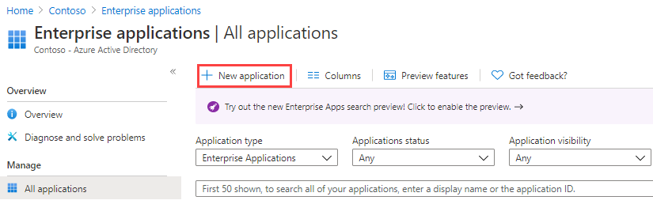

---
lab:
  title: 20 - Implementar o gerenciamento de acesso para aplicativos
  learning path: '03'
  module: Module 03 - Implement Access Management for Apps
---

# Laboratório 20 - Implementar o gerenciamento de acesso para aplicativos

## Cenário do laboratório

Sua organização exige que apenas usuários ou grupos específicos tenham acesso a aplicativos empresariais. É necessário atribuir um usuário a um aplicativo específico.

#### Tempo previsto: 5 minutos

### Exercício 1 - Configurar um aplicativo empresarial

#### Tarefa 1 - Adicionar um aplicativo ao seu locatário do Azure AD

1. Entre no  [https://portal.azure.com](https://portal.azure.com) usando uma conta de administrador global.

2. Abra o menu do portal e selecione  **Azure Active Directory**.

3. Na página Azure Active Directory, em **Gerenciar**, selecione **Aplicativos empresariais**.

4. No painel Aplicativos empresariais, selecione **+ Novo aplicativo**.

    

5. Na página Procurar na galeria do Azure AD (versão prévia), na caixa **Pesquisar aplicativo**, insira **GitHub**.

    

6. Nos resultados, selecione **GitHub Enterprise Cloud – conta corporativa**.

7. Em **GitHub Enterprise Cloud – conta corporativa**, examine as configurações e selecione **Criar**.

8. Uma vez criado, você será redirecionado para a página GitHub Enterprise Cloud – conta corporativa.

#### Tarefa 2 - Atribuir usuários a um aplicativo

1. Na folha GitHub Enterprise Cloud – conta corporativa, na página Visão geral, em **Introdução**, selecione **1. Atribuir usuários e grupos**.

2. Como alternativa, na navegação à esquerda, em **Gerenciar**, você pode selecionar **Usuários e grupos**.

3. Na página Usuários e grupos, no menu, selecione **+Adicionar usuário/grupo**.

4. Na página Adicionar atribuição, selecione **Usuários e grupos**.

5. No painel Usuários e grupos, selecione sua conta de administrador e clique em **Selecionar**.

    

6. Selecione **Atribuir**.

