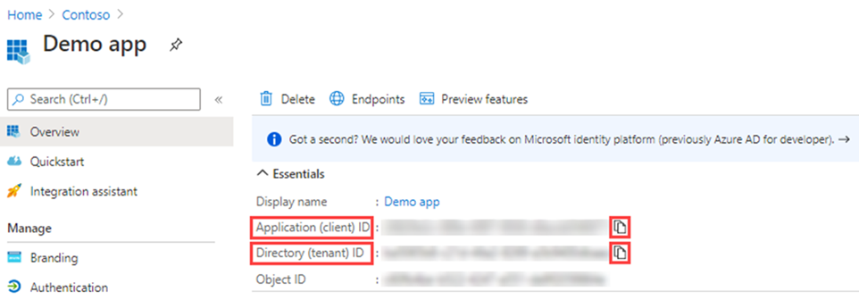
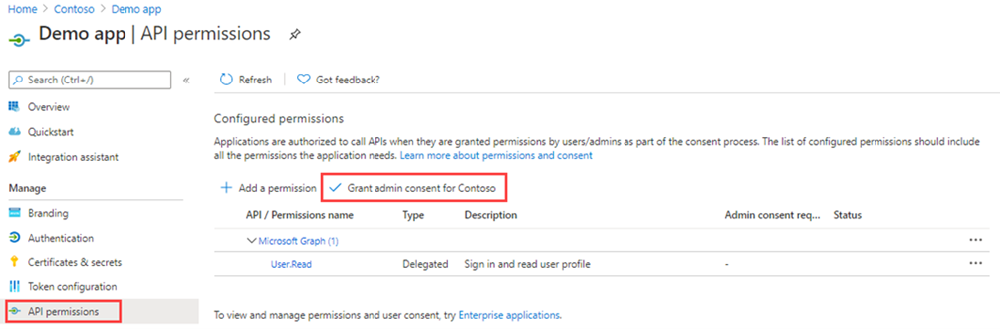

---
lab:
  title: 21 – Conceder consentimento de administrador em todo o locatário para um aplicativo
  learning path: '03'
  module: Module 03 - Implement Access Management for Apps
---

# Laboratório 21: conceder consentimento do administrador em todo o locatário para um aplicativo

## Cenário do laboratório

Para aplicativos desenvolvidos pela sua organização ou para aqueles registrados diretamente em seu locatário do Microsoft Entra, é possível conceder consentimento de administrador em todo o locatário de Registros de aplicativo no portal do Azure.

#### Tempo estimado: 15 minutos

### Exercício 1 – Consentimento do administrador

#### Tarefa 1 – Conceder consentimento do administrador nos Registros de aplicativo

   **Aviso** – A concessão de consentimento do administrador em todo o locatário para um aplicativo concederá ao aplicativo e ao seu fornecedor acesso aos dados da sua organização. Examine atentamente as permissões solicitadas pelo aplicativo antes de conceder consentimento.

A função de Administrador Global é necessária para fornecer consentimento de administrador para permissões de aplicativo para a API do Microsoft Graph.

1. Em um exercício anterior, você criou um aplicativo chamado Aplicativo de Demonstração. Caso necessário, no centro de administração do Microsoft Entra, navegue até **Identidade**, **Aplicativos** e, em seguida, **Registros de aplicativo** e selecione **Aplicativo de demonstração**.

2. Na tela **Aplicativo de demonstração**, localize, copie e salve cada valor de **ID de aplicativo (cliente)** e de **ID de diretório (locatário)** para poder usá-los mais tarde.

    **Observação** - **O aplicativo de demonstração** é criado nos laboratórios anteriores. Conclua-os antes deste laboratório.

    

3. No painel de navegação esquerdo, em **Gerenciar**, selecione **permissões de API**.

4. Em **Permissões configuradas**, selecione **Conceder consentimento de administrador**.

    

5. Examine a caixa de diálogo e selecione **Sim.**

   **Aviso** – A concessão de consentimento do administrador em todo o locatário por meio de Registros de aplicativo revogará todas as permissões concedidas anteriormente em todo o locatário. As permissões concedidas anteriormente pelos usuários em seu próprio nome não serão afetadas.

#### Tarefa 2 – Conceder consentimento do administrador em aplicativos empresariais

Você pode conceder consentimento de administrador em todo o locatário por meio de aplicativos empresariais se o aplicativo já tiver sido provisionado em seu locatário.

1. No centro de administração do Microsoft Entra, navegue até **Identidade > Aplicativos > Aplicativos empresariais > Aplicativo de demonstração.**

2. Na página **Aplicativo de demonstração**, em **Segurança,** no painel à esquerda, selecione **Permissões.**

3. Em **Permissões**, selecione **Conceder consentimento de administrador**.

    

   **Aviso** – A concessão de consentimento do administrador em todo o locatário por meio de Registros de aplicativo revogará todas as permissões concedidas anteriormente em todo o locatário. As permissões concedidas anteriormente pelos usuários em seu próprio nome não serão afetadas.

4. Quando solicitado, entre usando sua conta de Administrador global.

5. Na caixa de diálogo **Permissões solicitadas**, examine as informações e selecione **Aceitar**.
