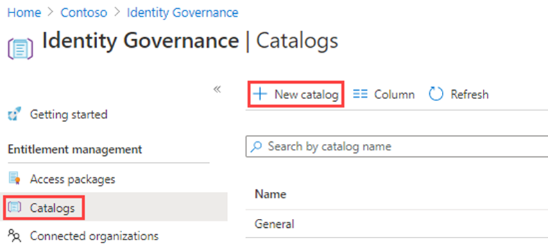

---
lab:
  title: 22 – Criar e gerenciar um catálogo de recursos no gerenciamento de direitos do Microsoft Entra
  learning path: '04'
  module: Module 04 - Plan and Implement and Identity Governance Strategy
---

# Laboratório 22 – Criar e gerenciar um catálogo de recursos no gerenciamento de direitos do Microsoft Entra

## Cenário do laboratório

Um catálogo é um contêiner de recursos e pacotes de acesso. Você cria um catálogo quando deseja agrupar recursos relacionados e pacotes de acesso. A pessoa que criar o catálogo se tornará o primeiro proprietário dele. Um proprietário de catálogo pode adicionar outros proprietários de catálogo. Você deve criar e configurar um catálogo em sua organização.

#### Tempo estimado: 15 minutos

### Exercício 1 – Construir recursos no Gerenciamento de Direitos

#### Tarefa 1 – Criar um catálogo

1. Entre no [https://entra.microsoft.com](https://entra.microsoft.com) usando uma conta de administrador global.

    **Importante** – Para usar e configurar os de termos de uso do Microsoft Entra ID, você precisa ter:
    - Assinatura do Microsoft Entra ID Premium P1, P2, EMS E3 ou EMS E5.
    - Se você não tiver uma dessas assinaturas, poderá obter a avaliação Premium do Microsoft Entra ID.
    - Uma das seguintes contas de administrador para o diretório que você deseja configurar:
        - Administrador Global
        - Administrador de Segurança
        - Administrador de Acesso Condicional

2. Abra o menu **Identidade** e selecione  **Governança de Identidade**.

3. No menu à esquerda, em **Gerenciamento de direitos**, selecione **Catálogos**.

4. No menu superior, selecione **+Novo catálogo**.

    

5. No painel Novo catálogo, na caixa **Nome**, insira **Marketing**.

6. Na caixa **Descrição**, insira **Para usuários do departamento de marketing**. Os usuários verão essas informações nos detalhes de um pacote de acesso.

7. Em **Habilitado, selecione Não**.

- - **Habilitado para usuários externos** permite que os usuários em diretórios externos selecionados possam solicitar pacotes de acesso nesse catálogo. Nenhuma alteração será feita nessa configuração.

9. Você pode optar por habilitar o catálogo para uso imediato ou desabilitar se pretender prepará-lo ou mantê-lo indisponível até quando pretender usá-lo. Para esse exercício, o catálogo não precisa ser habilitado.

    

10. Selecione Criar.

#### Tarefa 2 – Adicionar recursos a um catálogo

Para incluir recursos em um pacote de acesso, os recursos devem existir em um catálogo. Os tipos de recursos que você pode adicionar são grupos, aplicativos e sites do SharePoint Online. Os grupos podem ser grupos do Microsoft 365 criados na nuvem ou grupos de segurança do Microsoft Entra criados na nuvem. Os aplicativos podem ser aplicativos empresariais do Microsoft Entra, incluindo aplicativos SaaS e seus próprios aplicativos federados para o Microsoft Entra ID. Os sites podem ser sites do SharePoint Online ou conjunto de sites do SharePoint Online.

1. Na página Governança de identidade, se necessário, selecione **Catálogos**.

2. Na lista **Catálogos**, selecione **Marketing**.

3. No painel de navegação esquerdo, em **Gerenciar**, selecione **Recursos**.

4. No menu, selecione + **Adicionar recursos**.

5. Na página Adicionar recursos ao catálogo, examine as opções disponíveis.  Adicione os itens a seguir:

   | Tipo de recurso | Valor |
   | :------------- | :---------- |
   |  **Grupos e Equipes** | Retail |
   |  **Aplicativos** | Box |
   |  **Aplicativos** | Salesforce |
   |  **Sites do SharePoint** | Marca SharePoint <<<escolha na sua lista de sites do SharePoint disponíveis |

6. Talvez você não tenha recursos em Grupos e equipes, Aplicativos ou Sites do SharePoint. Selecione qualquer categoria de recurso e, em seguida, um recurso dessa categoria.

7. Para esse exercício, você pode escolher qualquer recurso disponível.

    

8. Quando terminar, selecione **Adicionar**. Esses recursos agora podem ser incluídos em pacotes de acesso no catálogo.

#### Tarefa 3 – Adicionar outros proprietários de catálogo

O usuário que criou um catálogo se torna o primeiro proprietário do catálogo. Para delegar o gerenciamento de um catálogo, você adiciona usuários à função de proprietário do catálogo. Isso ajuda a compartilhar as responsabilidades de gerenciamento de catálogo.

1. Se necessário, no centro de administração do Microsoft Entra, navegue até **Identidade**, selecione **Governança de identidade** e, em seguida, **Catálogos** e selecione **Marketing**.

2. Na página do Catálogo de marketing, no menu de navegação à esquerda, selecione **Funções e administradores**.

    

3. No menu superior, analise as funções disponíveis e selecione **+ Adicionar proprietário de catálogo**.

4. No painel Selecionar membros, selecione **Adele Vance** e clique em **Selecionar**.

5. Analise a função recém-adicionada na lista Funções e administradores.

#### Tarefa 4 – Editar um catálogo

É possível editar o nome e a descrição de um catálogo. Os usuários veem essas informações nos detalhes de um pacote de acesso.

1. Na página Marketing, no painel de navegação esquerdo, selecione **Visão geral**.

2. No menu superior, selecione **Editar**.

3. Analise a configuração e, em **Propriedades**  >  **Habilitado**, selecione **Sim**.

    

4. Selecione **Salvar**.

#### Tarefa 5 – Criar revisões de acesso para usuários convidados

1. As revisões de acesso podem gerenciar o ciclo de vida do acesso.O Microsoft Entra Identity Governance fornece um painel de visão geral mostrando o status das revisões de acesso. Selecione **Revisões de acesso** no menu **Governança de identidade**.

1. No menu Revisão de acesso, você pode selecionar **Revisões de acesso** para configurar uma revisão de acesso para usuários convidados.Você selecionará **+ Nova revisão de acesso** para criar sua revisão de acesso de usuário convidado.O bloco será aberto para configurar a revisão de acesso para usuários convidados.

1. Selecione **Equipes + Grupos** em **Selecionar o que revisar**.

1. Em **Selecionar escopo de revisão**, selecione **Todos os grupos do Microsoft 365 com usuários convidados**

1. Em **Selecionar escopo de usuário**, selecione **Somente usuários convidados**.

1. Selecione **Próximo: Revisões**.

1. O próximo bloco é onde você configura quem revisa e aprova o acesso, com que frequência o acesso será revisado e quando o acesso expirará.

1. Em **Selecionar revisores**, selecione **Proprietários de grupo** como esses revisores. **Observação**: os usuários convidados não devem ter permissão para revisar seu próprio acesso como uma boa prática de governança de identidade.

1. Insira uma **Duração (em dias)**, o padrão é 3, escolha uma **Recorrência de revisão** e **Data de início** para a revisão.

1. Selecione **Avançar: configurações** e defina as configurações de como a revisão ocorrerá e o que acontece quando o usuário convidado responde ou não responde.  Uma boa prática é selecionar **Aplicar resultados automaticamente ao recurso** e selecionar **Remover acesso** em **Se os revisores não responderem**. 

1. Selecione **Avançar: Revisar + criar** e, em seguida, selecione **Criar** para criar a nova **Revisão de acesso**.

#### Tarefa 6 – Excluir um catálogo

Você poderá excluir um catálogo, mas somente se ele não tiver nenhum pacote de acesso.

1. Na página Visão geral do catálogo de marketing, no menu superior, selecione Excluir.

2. Na caixa de diálogo Excluir, analise as informações e selecione **Não**.

    **Observação** – estamos mantendo o catálogo para uso no próximo laboratório.
