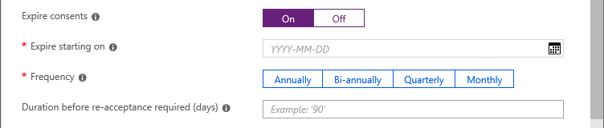
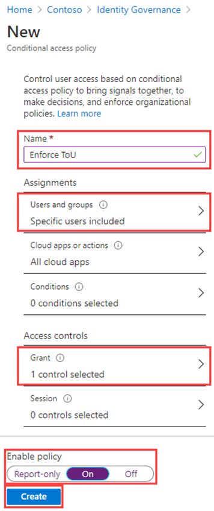
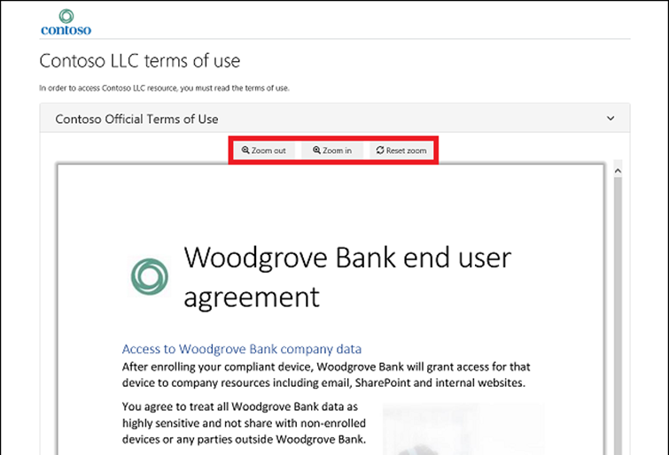
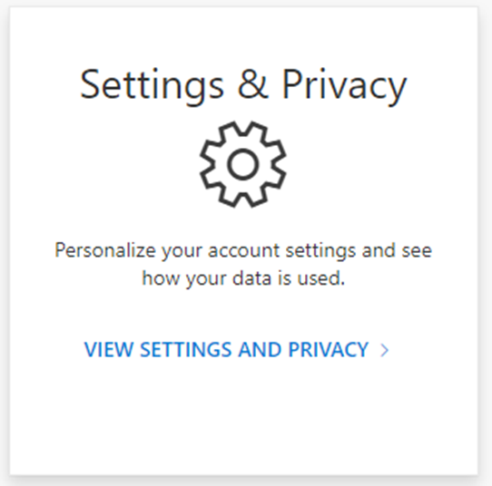

---
lab:
  title: 23 - Adicionar o relatório de aceitação e os termos de uso
  learning path: '04'
  module: Module 04 - Plan and Implement and Identity Governance Strategy
---

# Laboratório 23: Adicionar o relatório de aceitação e os termos de uso 

## Cenário do laboratório

As políticas de termos de uso do Microsoft Entra fornecem um método simples que as organizações podem usar para apresentar informações aos usuários finais. Essa apresentação faz com que os usuários vejam os avisos de isenção de responsabilidade relevantes para os requisitos de conformidade ou legais. Este artigo descreve como começar a usar as políticas de termos de uso (ToU).

Você deve criar e impor uma política de termos de uso para sua organização.

#### Tempo previsto: 20 minutos

### Exercício 1 - Configurar um termo de uso e testá-lo

#### Tarefa 1 - Adicionar termos de uso

Quando o documento dos termos de uso estiver pronto, use o procedimento a seguir para adicioná-lo.

1. Entre no [https://entra.microsoft.com](https://entra.microsoft.com)usando uma conta de administrador global.

2. Clique em  **Governança de identidade** no menu de navegação à esquerda.

3. No menu, em **Gerenciamento de direitos**, clique em **Termos de uso**.

4. Na página Termos de uso, no menu superior, selecione **+ Novos termos**

    

5. Na caixa **Nome**, insira os **Termos de uso de teste**.

    **Observação** – Esses são os termos de uso que serão usados no portal do Azure.

6. Marque a **caixa do documento de termos de uso**, navegue até o PDF dos termos de uso finalizado e selecione-o.

   **Arquivo termos de uso fornecido** - navegue até o repositório github AllFiles/Labs/Lab26 para obter um documento PDF de exemplo dos termos do usuário para uso neste laboratório.

7. Na caixa **Nome de exibição**, insira os **Termos de uso da Contoso**.

    **Observação** – Este é o título que os usuários veem ao entrar.

8. Selecione **Inglês** como idioma para o documento de termos de uso.

   **Observação** - A opção de idioma permite carregar vários termos de uso, cada um com um idioma diferente. A versão dos termos de uso que um usuário final verá terá base em suas preferências de navegador.

9. Para exigir que os usuários finais leiam os termos de uso antes de aceitá-los, defina **Exigir que os usuários expandam os termos de uso** como **Ativado**.

10. Para exigir que os usuários finais aceitem os termos de uso em todos os dispositivos pelos quais estiverem acessando, defina **Exigir consentimento dos usuários em todos os dispositivos** como **Desativado**. Os usuários poderão ser solicitados a instalar aplicativos adicionais se essa opção estiver habilitada.

    **Aviso** – O consentimento em cada dispositivo exigirá que os usuários registrem cada dispositivo no Microsoft Entra ID antes de receber acesso. É prática recomendada exigir essa configuração para Ativado; no entanto, para fins de um laboratório mais limpo, estamos usando Desativado.

11. Se você quiser expirar os consentimentos dos termos de uso em um agendamento, defina **Expirar consentimentos** como **Ativado**. Quando definido como Ativado, duas configurações de cronograma adicionais são exibidas.

    

12. Use as configurações **Expirar a partir de** e **Frequência** para especificar o agendamento das expirações de termos de uso. A tabela a seguir mostra o resultado para duas configurações de exemplo:

    | Expirar a partir de | Frequência | Resultado |
    |---|---|---|
    | Data de hoje | Mensal | A partir de hoje, os usuários devem aceitar os termos de uso e, no depois, aceitá-los novamente todos os meses.|
    | Data no futuro | Mensal | A partir de hoje, os usuários devem aceitar os termos de uso. Quando a data futura chegar, os consentimentos irão expirar e depois os usuários devem aceitar novamente a todos os meses. |

    Por exemplo, se você definir a expiração a partir da data para **1 de janeiro** e a frequência para **Mensal**, segue como ocorreriam as expirações para dois usuários:

    | Usuário | Primeira data de aceitação | Primeira data de expiração | Segunda data de expiração | Terceira data de expiração |
    |---|---|---|---|---|
    | Alice | 1 de janeiro | 1 de fevereiro | 1 de março | 1 de abril|
    | Roberto | 15 de janeiro | 1 de fevereiro | 1 de março| 1 de abril |

13. Use a configuração **Duração (dias) até exigir a nova aceitação** para especificar o número de dias antes que o usuário deva aceitar novamente os termos de uso. Isso permite que os usuários sigam seu próprio cronograma. Por exemplo, se você definir a duração como **30** dias, segue como ocorreriam as expirações para dois usuários:

    | Usuário | Primeira data de aceitação | Primeira data de expiração | Segunda data de expiração | Terceira data de expiração |
    |---|---|---|---|---|
    | Alice | 1 de janeiro | 31 de janeiro | 2 de março | 1 de abril|
    | Roberto | 15 de janeiro | 14 de fevereiro | 16 de março| 15 de abril

    **Observação** - É possível usar as configurações Expirar consentimentos e Duração (dias) até exigir a nova aceitação juntas, mas normalmente você usa uma ou a outra.

14. Em **Acesso condicional**, selecione **Política personalizada**.

    | Modelo | Descrição |
    |---|---|
    | **Acesso a aplicativos de nuvem para todos os convidados** | Uma política de acesso condicional será criada para todos os convidados e todos os aplicativos de nuvem. Essa política afeta o portal do Azure. Após ela ser criada, talvez seja necessário sair e entrar novamente. | 
    |**Acesso a aplicativos de nuvem para todos os usuários** | Uma política de acesso condicional será criada para todos os usuários e todos os aplicativos de nuvem. Essa política afeta o portal do Azure. Após ela ser criada, será necessário sair e entrar novamente. |
    | **Política personalizada** | Selecione os usuários, grupos e aplicativos aos quais esses termos de uso serão aplicados. |
    | **Criar a política de acesso condicional mais tarde** | Esses termos de uso serão exibidos na lista de controle de concessão ao criar uma política de Acesso Condicional. |

    **IMPORTANTE**Controles de política de Acesso Condicional (incluindo termos de uso) não dão suporte à imposição em contas de serviço. Recomenda-se excluir todas as contas de serviço da política de Acesso Condicional.

    As políticas de Acesso Condicional personalizadas permitem termos de uso granulares, para até um aplicativo de nuvem ou um grupo de usuários específicos. Para obter mais informações, consulte [https://docs.microsoft.com/en-us/azure/active-directory/conditional-access/require-tou](https://docs.microsoft.com/en-us/azure/active-directory/conditional-access/require-tou).

15. Quando concluir, selecione **Criar**.

    

16. Quando os termos de uso forem criados, você será redirecionado automaticamente para a página de política de acesso condicional. Na página, na caixa **Nome**, insira **Impor termos de uso**.

17. Em **Atribuições**, clique em **Identidades de usuários**.

18. Na guia Incluir, marque a caixa de seleção **Usuários e grupos**.

19. No painel Selecionar, selecione**Adele Vance** para usar para testar a política de termos de uso.

   **Aviso** - Se você escolher sua conta de administrador, como todas as políticas de acesso condicional, garanta que tenha outra conta com permissões suficientes para alterar a política de acesso condicional. O objetivo disso é garantir que sua conta de administrador não será bloqueada caso a política de acesso condicional resulte em um algo indesejado.

20. Clique em **Recursos de destino**.

21. Selecione **Todos os aplicativos de nuvem**.

22. Em **Controles de acesso**, selecione **Conceder**.

23. No painel Conceder, selecione os **Termos de uso de teste** e **Selecionar**.

24. Em **Habilitar política**, selecione **Ativar**.

25. Quando concluir, selecione **Criar**.

    

26. Se você optar por usar sua própria conta, poderá atualizar o navegador. Será solicitado que você entre novamente. Quando você entrar, será necessário aceitar os termos de uso.

#### Tarefa 2 - Faça login como Adele

1. Abra uma nova janela do navegador anônima.
2. Conecte-se ao https://portal.azure.com.
3. Se aparecer dizendo que você já está conectado, selecione o nome do usuário conectado no canto superior direito da tela e escolha **Entrar com uma conta diferente**.
4. Faça login como Adele:

    | Configuração | Valor a ser inserido |
    | :--- | :--- |
    | Nome de usuário | **AdeleV@** `<<your domain name>>.onmicrosoft.com` |
    | Senha | Insira a senha de administrador do locatário(Consulte a guia Recursos de laboratório para recuperar a senha de administrador do locatário) |

5. Valide o login de Adele com a solicitação MFA.
6. Exiba os termos de uso.
7. Você pode escolher **Aceitar** ou **Recusar**.

    **Observação** - Se você optar por **recusar** , durante um login futuro como AdeleV, será novamente solicitado que você visualize e aceite os termos de uso.

    **Observação**: Os termos de uso podem levar alguns minutos para aparecer ou você pode sair e fazer login novamente no portal.
 
#### Tarefa 3 - Exibir relatório de quem aceitou e recusou

A página termos de uso mostra uma contagem de usuários que os aceitaram e recusaram. Essas contas e quem aceitou/recusou ficam armazenados enquanto os termos de uso estão em vigor.

1. No Microsoft Azure, em  **Identity Governance > Termos de uso**, localize seus termos de uso.

2. Para um Termos de uso, selecione os números em **Aceito** ou **Recusado** para exibir o estado atual dos usuários.

    

3. Nesse exercício, você pode não ter nenhum termo de uso aceito ou recusado. No exemplo a seguir, o valor **Aceito** foi selecionado. Você pode ver as informações de usuário relatadas para os usuários que aceitaram os termos de uso.

    

4. Na página **Consentimento de termos de uso** selecione **Baixar** para baixar um relatório de consentimentos.

5. Na página **Identity Governance | Termos de uso**, destaque **Teste dos termos de uso** e selecione **Exibir logs de auditoria selecionados** para visualizar a atividade de logs de auditoria.

#### Tarefa 4 - Como os termos de uso aparecem para os usuários

1. Depois que os termos de uso forem criados e aplicados, os usuários que estiverem no escopo verão a página de termos de uso.

    

2. Os usuários podem exibir os termos de uso e, se necessário, usar os botões para aumentar e reduzir o zoom.

    

3. Em dispositivos móveis, os termos de uso aparecerão de forma semelhante ao exemplo a seguir.

    

#### Tarefa 5 - Como os usuários podem analisar os termos de uso

Os usuários podem analisar e ver os termos de uso aceitos usando o procedimento a seguir.

1. Navegue até [https://myapps.microsoft.com](https://myapps.microsoft.com/) e entre usando a sua conta de usuário.

2. Selecione a foto do perfil do usuário e depois **Exibir conta**. Na página Visão geral, selecione EXIBIR CONFIGURAÇÕES E PRIVACIDADE.

    

3. Na página Configurações e privacidade, selecione a guia **Privacidade**.

    

4. Em **Aviso da organização**, você pode analisar os termos de uso que aceitou.

#### Tarefa 6 - Editar os detalhes dos termos de uso

Você pode editar alguns detalhes dos termos de uso, mas não é possível modificar um documento existente. O procedimento a seguir descreve como editar os detalhes.

1. Entre no  [https://entra.microsoft.com](https://entra.microsoft.com) como administrador global.

2. Abra o item do Microsoft Entra ID e, no menu, clique em  **Governança de Identidade**.

3. No menu de navegação à esquerda, em **Gerenciamento de direitos**, clique em **Termos de uso**.

4. Selecione os termos de uso que você deseja editar.
 - Observação: você deve clicar no espaço aberto, não diretamente no nome dos Termos de uso.

5. No menu superior, selecione **Editar termos**.

6. No painel Editar termos de uso, você pode mudar o seguinte:

    - **Nome** – é o nome interno dos termos de uso que não é compartilhado com os usuários finais
  
    - **Nome de exibição** – é o nome que os usuários finais veem ao exibir os termos de uso

    - **Exigir que os usuários expandam os termos de uso** – Definir isso como **Ativado** forçará o usuário final a expandir o documento de termos de uso antes de aceitá-lo.

    - **Atualizar um documento de termos de uso existente**.

    - Você pode adicionar um idioma para um termos de uso. Se houver outras configurações que você queira alterar, como exigir consentimento dos usuários em todos os dispositivos, expirar consentimentos, duração para nova aceitação, ou a política de Acesso Condicional, é necessário criar novos termos de uso.

    

7. Quando terminar, selecione **Salvar** para salvar as alterações.

#### Tarefa 7 - Atualizar um documento de termos de uso existente

Ocasionalmente, você pode ter de atualizar o documento de termos de uso.

1. Selecione os termos de uso que você deseja editar.

2. Selecione **Editar termos**.

3. Na tabela **Opções de idioma**, identifique o idioma dos termos de uso que você deseja atualizar e, na coluna **Ação**, selecione **Atualizar**.

    

4. No painel Atualizar a versão dos termos de uso, você pode carregar uma nova versão do documento de termos de uso.

5. Além disso, você poderá usar o botão de alternância **Exigir nova aceitação** se desejar exigir que os usuários aceitem essa nova versão na próxima vez que entrarem. Se você não quiser que os usuários aceitem novamente, o consentimento anterior permanecerá em vigor, e somente os novos usuários que ainda não consentiram ou cujo consentimento expirar receberão a nova versão.

    

6. Depois de carregar o novo PDF e decidir sobre a necessidade de os usuários aceitarem novamente, selecione **Adicionar**.

7. Agora, você verá a versão mais recente na coluna Documento.
