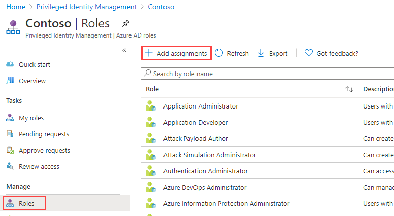

---
lab:
  title: 26 – Configurar o Privileged Identity Management para funções do Microsoft Entra
  learning path: '04'
  module: Module 04 - Plan and Implement and Identity Governance Strategy
---

# Laboratório 26 – Configurar o Privileged Identity Management para funções do Microsoft Entra

### Tipo de logon = administração do Microsoft 365

## Cenário do laboratório

Um administrador de funções com privilégios pode personalizar o PIM (Privileged Identity Management) em sua organização do Microsoft Entra, incluindo alterar a experiência de um usuário que está ativando uma atribuição de função elegível. Você deve se familiarizar com a configuração do PIM.

#### Tempo estimado: 30 minutos

OBSERVAÇÃO – Houve mudanças contínuas na exigência de MFA em ambientes de laboratório.  Ao alternar entre usuários para concluir este laboratório, pode ser solicitado que você configure a MFA.

### Exercício 1 – Definir as configurações de função do Microsoft Entra

#### Tarefa 1 – Abrir configurações de função

Siga estas etapas para abrir as configurações de uma função do Microsoft Entra.

1. Entre no  [https://entra.microsoft.com](https://entra.microsoft.com) como um Administrador global.

2. Pesquise e selecione o **Privileged Identity Management.**

3. Na página Privileged Identity Management, na navegação à esquerda, selecione **Funções do Microsoft Entra.**

4. Na página Início rápido, no painel de navegação esquerdo, selecione **Configurações.**

    

5. Analise a lista de funções e, em **Pesquisar por nome de função**, insira **conformidade**.

6. Nos resultados, selecione **Administrador de conformidade**.

7. Analise as informações dos detalhes da configuração de função.

#### Tarefa 2 – Exigir aprovação para ativar

Caso esteja configurando vários aprovadores, a aprovação será concluída assim que um deles for aprovado ou negado. Você não pode exigir aprovação de pelo menos dois usuários. Para exigir aprovação para ativar uma função, siga estas etapas.

1. Na página Detalhes da configuração da função, no menu superior, selecione **Editar**.

    

2. Na tela Editar configuração de função – Administrador de conformidade, marque a caixa de seleção **Exigir aprovação para ativar**.

3. Selecione **Selecionar aprovadores**.

4. No painel Selecionar um membro, escolha sua conta de administrador e clique em **Selecionar**.

    

5. Depois de definir as configurações da função, selecione **Atualizar** para salvar suas alterações.

### Exercício 2 – Usar um PIM para atribuir funções do Microsoft Entra

#### Tarefa 1 – Atribuir uma função

Com o Microsoft Entra ID, um Administrador global pode tornar permanentes as atribuições de função de administrador do Microsoft Entra. Essas atribuições de função podem ser criadas usando o Centro de administração do Microsoft Entra, ou o portal do Azure, ou usando comandos do PowerShell.

O serviço PIM (Privileged Identity Management) também permite que os Administradores de função com privilégios façam atribuições de funções de administrador permanente. Além disso, os Administradores de funções com privilégios podem tornar os usuários qualificados para funções de administrador do Microsoft Entra. Um administrador qualificado pode ativar a função quando necessário e suas permissões expirarão assim que forem feitas.

Siga estas etapas para tornar um usuário elegível para uma função de administrador do Microsoft Entra.

1. Entre no [https://entra.microsoft.com](https://entra.microsoft.com) usando uma conta de administrador global.

2. Pesquise e selecione o **Privileged Identity Management.**

    **Observação** – você pode encontrá-lo no menu em Identidade – Governança de Identidade – Privileged Identity Management.

3. Na página Privileged Identity Management, na navegação à esquerda, selecione **Funções do Microsoft Entra.**

4. Na página Início rápido, no painel de navegação esquerdo, selecione **Funções**.

5. No menu superior, selecione **+ Adicionar atribuições**.

    

6. No painel Adicionar atribuições, na guia **Associação**, revise as configurações.

7. Selecione o menu **Selecionar função** e depois **Administrador de conformidade**.

8. Você pode usar o filtro **Pesquisar função por nome** para obter ajuda para localizar uma função.

9. Em **Selecionar membro(s)**, escolha **Nenhum membro selecionado**.

10. No painel Selecionar um membro, selecione **Miriam Graham** e, em seguida, selecione **Selecionar**.

    

11. Na página Adicionar atribuições, selecione **Avançar**.

12. Na guia **Configurações**, em **Tipo de atribuição**, analise as opções disponíveis. Para essa tarefa, use a configuração padrão.

    - Atribuições Qualificadas exigem que o membro da função execute uma ação para usar a função. As ações podem incluir a execução de uma verificação de Autenticação multifator (MFA), fornecimento de uma justificativa comercial ou solicitação de aprovação dos aprovadores designados.
    - As atribuições Ativas não exigem que o membro execute nenhuma ação para usar a função. Membros atribuídos como ativos sempre têm os privilégios atribuídos à função.

13. Revise as configurações restantes, depois selecione **Atribuir**.

#### Tarefa 2 – Entrar com Miriam

1. Abra uma janela do navegador InPrivate.
2. Entre no Centro de administração do Microsoft Entra (https://entra.microsoft.com).
    **Observação** – Se ele for aberto com um usuário conectado, selecione seu nome no canto superior direito e selecione **Entrar como uma conta diferente**.
3. Fazer logon com Miriam.

   | Campo | Valor |
   | :--- | :--- |
   | Nome de Usuário | **MiriamG@**`<<your domain.onmicrosoft.com>>` |
   | Senha |  Insira a senha de administrador do locatário(Consulte a guia Recursos do laboratório para recuperar a senha de administrador do locatário) |

4. No menu **Identidade** , abra **Usuários** e selecione **Todos os usuários**.
5. Encontre **Miriam** na lista de usuários
6. Na página **Visão geral**, procure as **funções atribuídas**.
7. Selecione **Atribuições elegíveis**.
1. Observe que a função de **Administrador de conformidade** agora está disponível para Miriam.

#### Tarefa 3 – Ativar suas funções Microsoft Entra

Quando você precisar assumir uma função do Microsoft Entra, poderá solicitar a ativação abrindo **Minhas funções** no Privileged Identity Management.

1. Na barra **Pesquisar recursos, serviços e documentos**, procure Privileged.
2. Abra a página **Privileged Identity Management**.
3. Na página do Privileged Identity Management, no menu de navegação à esquerda, selecione **Minhas funções.**

4. Na página Minhas funções, revise a lista de **Atribuições elegíveis**.

    

5. Na linha função de Administrador de conformidade, selecione **Ativar**.

6. No painel Ativar – Administrador de conformidade, selecione **Verificação adicional necessária** e siga as instruções para fornecer uma verificação de segurança adicional. Você precisa se autenticar apenas uma vez por sessão.

    

    **Verificação** – Com base em nossa configuração atual do ambiente de laboratório, será necessário configurar o MFA e efetuar login com êxito.

7. Depois de concluir a verificação de segurança adicional, no painel Ativar – Administrador de conformidade, na caixa **Motivo**, insira **Esta é a minha justificativa para ativar essa função**.

    **Observação importante** – O princípio de privilégio mínimo. Você só deve ativar a conta para o período de tempo que você precisar dela.  Se o trabalho precisar ser feito, leva apenas uma hora e meia, então defina a duração para duas horas.  Da mesma forma, se você souber que não poderá fazer o trabalho até depois das 15h, escolha um horário de ativação personalizado.

8. Selecione **Ativar**.

#### Tarefa 4 – Atribuir uma função com escopo restrito

Para determinadas funções, o escopo das permissões concedidas pode ser restrito a uma única unidade de administração, uma única entidade de serviço ou um único aplicativo. Esse procedimento é um exemplo de como atribuir uma função que tenha o escopo de uma unidade administrativa.

1. Lembre-se de fechar as janelas do navegador de MiriamG e, em seguida, abra o Centro de administração do Microsoft Entra com sua conta de administrador.
2. Navegue até a página Privileged Identity Management e, no menu de navegação à esquerda, selecione **Funções do Microsoft Entra.**
3. Selecione **funções**.
4. Na página Funções, no menu superior, selecione **+ Adicionar atribuições.**

5. Na página Adicionar atribuições, selecione o menu **Selecionar função**, depois selecione **Administrador de usuários.**

6. Selecione o menu **Tipo de escopo** e analise as opções disponíveis. Por enquanto, você usará o tipo de escopo **Diretório**.

   **Dica** - Vá para [https://docs.microsoft.com/en-us/azure/active-directory/roles/admin-units-manage](https://docs.microsoft.com/en-us/azure/active-directory/roles/admin-units-manage) para obter mais informações sobre o tipo de escopo da unidade administrativa.

7. Tal como você fez ao atribuir uma função sem um escopo restrito, você adicionaria membros e concluiria as opções de configurações. Por enquanto, selecione **Cancelar**.

#### Tarefa 5 – Atualizar ou remover uma atribuição de função existente

Siga estas etapas para atualizar ou remover uma atribuição de função existente.

1. Na Página Abrir o Privileged Identity Management > Funções do Microsoft Entra, na navegação à esquerda, selecione **Atribuições**.

2. Na lista **Atribuições**, em Administrador de conformidade, analise as opções na coluna **Ação**.

    

3. Selecione **Atualizar** e analise as opções disponíveis no painel Configurações de associação. Ao concluir, feche o painel.

4. Selecione **Remover**.

5. Na caixa de diálogo **Remover**, analise as informações e selecione **Sim**.
